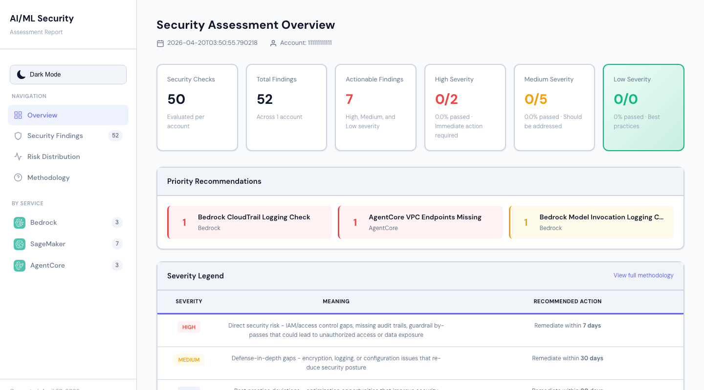
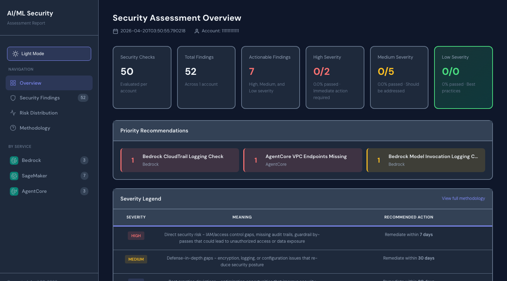
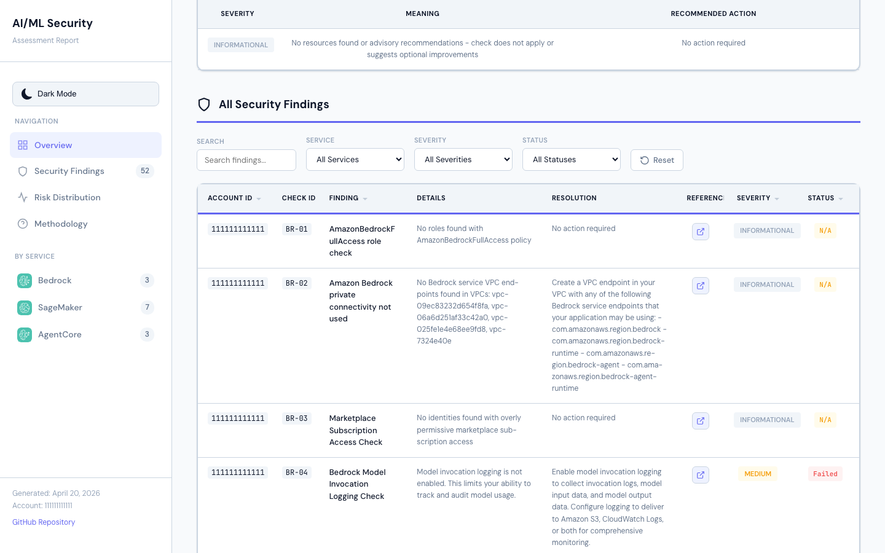
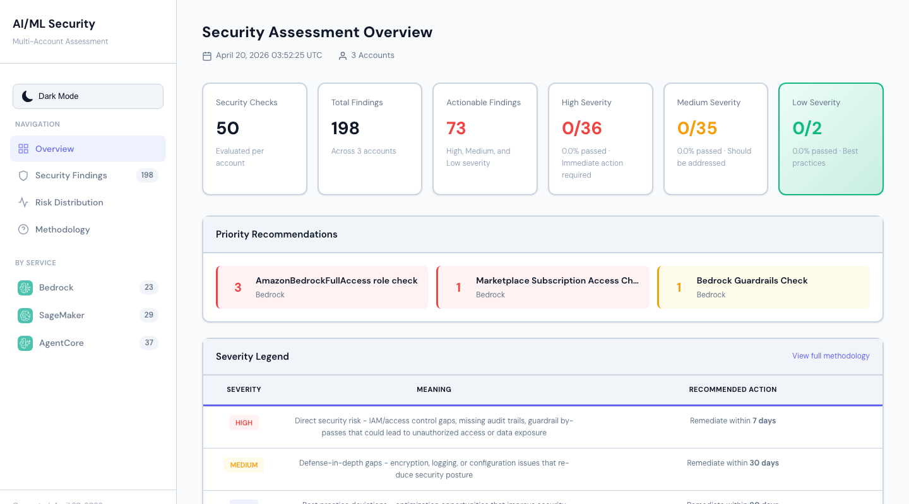
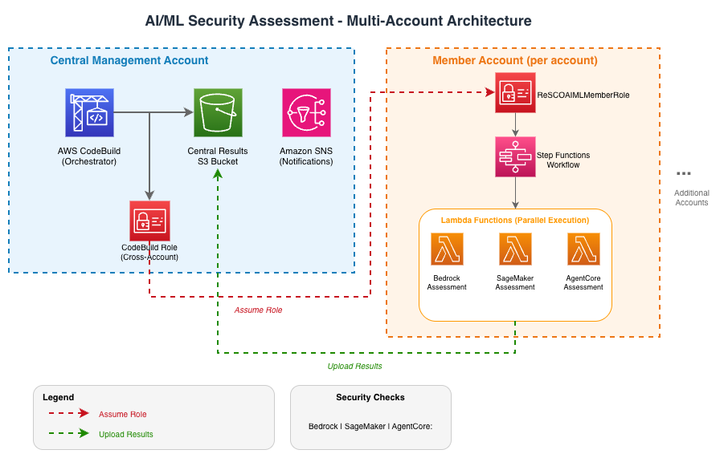

# AWS AI/ML Security Assessment Framework

[](https://opensource.org/licenses/MIT-0) [](https://www.python.org/downloads/) [](https://aws.amazon.com/serverless/sam/) [](https://aws.amazon.com/serverless/)

> **Open-source automated security scanner for Amazon Bedrock, SageMaker AI, and Bedrock AgentCore** - Built on [AWS Well-Architected Framework (Generative AI Lens)](https://docs.aws.amazon.com/wellarchitected/latest/generative-ai-lens/generative-ai-lens.html)

Cloud security automation with **52 security checks** for your generative AI and machine learning workloads. Identify IAM misconfigurations, encryption gaps, network isolation issues, and compliance violations with interactive HTML reports and actionable remediation guidance.

---

## See It In Action

The framework generates professional, interactive security assessment reports with filtering, search, and dark mode support.

**Download Sample Reports** | [Single Account](sample-reports/security_assessment_single_account.html) | [Multi-Account](sample-reports/security_assessment_multi_account.html)

<table>
  <tr>
    <td width="50%">
      
      <p align="center"><em>Executive Dashboard (Light Mode)</em></p>
    </td>
    <td width="50%">
      
      <p align="center"><em>Executive Dashboard (Dark Mode)</em></p>
    </td>
  </tr>
  <tr>
    <td colspan="2">
      
      <p align="center"><em>Interactive Findings Table with Filtering</em></p>
    </td>
  </tr>
  <tr>
    <td colspan="2">
      
      <p align="center"><em>Multi-Account Consolidated View</em></p>
    </td>
  </tr>
</table>

### Key Features

- **Executive Summary** with severity counts and service breakdown
- **Priority Recommendations** highlighting critical issues requiring immediate attention
- **52 Security Checks** across Amazon Bedrock, SageMaker AI, and Bedrock AgentCore
- **Interactive Filtering** by account, service, severity, and status
- **Light/Dark Mode Toggle** with persistent user preference
- **Text Search** across all findings with real-time results
- **Direct AWS Documentation Links** for each finding with remediation guidance
- **Multi-Account Support** with consolidated reporting across your organization
- **Fully Automated** deployment and execution via AWS CloudFormation and AWS CodeBuild

---

## Table of Contents

- [What It Does](#what-it-does)
- [Why Use This Framework?](#why-use-this-framework)
- [Quick Start](#quick-start)
- [Architecture](#architecture)
- [Prerequisites](#prerequisites)
- [Single-Account Deployment](#single-account-deployment)
- [Multi-Account Deployment](#multi-account-deployment)
- [How It Works](#how-it-works)
- [Permissions Required](#permissions-required)
- [Viewing Assessment Results](#viewing-assessment-results)
- [Customization](#customization)
- [Cleanup](#cleanup)
- [Documentation](#documentation)
- [Contributing](#contributing)
- [Security](#security)
- [License](#license)

---

## What It Does

This serverless assessment framework automatically evaluates your AI/ML workloads against AWS security best practices. It uses AWS serverless services to gather data from the control plane and generate reports containing the status of various security checks, severity levels, and recommended actions.

Designed for workloads using [Amazon Bedrock](https://aws.amazon.com/bedrock/), [Amazon Bedrock AgentCore](https://aws.github.io/bedrock-agentcore-starter-toolkit/), or [Amazon SageMaker AI](https://aws.amazon.com/sagemaker/ai/).

### Why Use This Framework?

| Challenge | How This Framework Helps |
|-----------|-------------------------|
| **Manual security audits are time-consuming** | Fully automated scanning with one-click CloudFormation deployment |
| **Inconsistent security checks across teams** | Standardized 52-check assessment based on AWS Well-Architected best practices |
| **Difficulty tracking AI/ML security posture** | Interactive HTML dashboards with severity breakdown and trend visibility |
| **Multi-account complexity** | Consolidated reporting across AWS Organizations with cross-account role assumption |
| **Compliance and audit requirements** | Exportable reports with remediation guidance linked to AWS documentation |
| **Generative AI security gaps** | Purpose-built checks for LLM guardrails, model access controls, and prompt injection prevention |

**Services Covered:**
- **Amazon Bedrock** (14 checks) - Guardrails, encryption, Amazon VPC endpoints, AWS IAM permissions, model invocation logging
- **Amazon SageMaker AI** (25 checks) - Security Hub controls (SageMaker.1-5), encryption, network isolation, AWS IAM, MLOps
- **Amazon Bedrock AgentCore** (13 checks) - Amazon VPC configuration, encryption, observability, resource policies

**Deployment Options:**
- **Single-Account**: Assess security in one AWS account
- **Multi-Account**: Scan entire AWS Organizations with consolidated reporting

**How It Works:**
1. Deploy via AWS CloudFormation (one-click deployment)
2. Framework automatically scans your AI/ML resources
3. Generates interactive HTML reports stored in your Amazon S3 bucket
4. All data stays in your AWS account - no external dependencies

---

## Quick Start

- **Single-Account**: Jump to [Single-Account Deployment](#single-account-deployment)
- **Multi-Account**: Jump to [Multi-Account Deployment](#multi-account-deployment)

## Architecture



## Prerequisites

- Python 3.12+ - [Install Python](https://www.python.org/downloads/)
- AWS SAM CLI - [Install the AWS SAM CLI](https://docs.aws.amazon.com/serverless-application-model/latest/developerguide/serverless-sam-cli-install.html)
- Docker (optional) - [Install Docker community edition](https://hub.docker.com/search/?type=edition&offering=community) - Only required for local development and testing, not for AWS deployment

## Single-Account Deployment

1. Download the [aiml-security-single-account.yaml](deployment/aiml-security-single-account.yaml) AWS CloudFormation template.
2. **[Deploy to AWS CloudFormation](https://console.aws.amazon.com/cloudformation/home#/stacks/create/template?stackName=aiml-security-single-account)**
3. Upload the AWS CloudFormation template from step 1.
4. Provide a stack name and optionally specify your email address to receive notifications.
5. Leave all other parameters at their default values.
6. Navigate to the next page, read and acknowledge the notice, and click **Next**.
7. Review the information and click **Submit**.
8. Wait for the AWS CloudFormation stack to complete.
9. Once complete, AWS CodeBuild automatically deploys the assessment stack and runs the assessment.
10. To view results:
    - Navigate to the AWS CloudFormation console
    - Open the stack you deployed (e.g., `aiml-security-single-account` or your custom name)
    - Go to the **Outputs** tab
    - Copy the `AssessmentBucket` value
    - Navigate to that Amazon S3 bucket and open the `{account_id}/security_assessment_*.html` file

### Understanding Stack Names

> **Important**: The deployment creates **TWO** AWS CloudFormation stacks. Only one contains your results!

<table>
<tr>
<th>Stack Type</th>
<th>How to Identify</th>
<th>What It Contains</th>
<th>What to Do</th>
</tr>
<tr>
<td><strong>Infrastructure Stack</strong><br/><em>(This is the one you need)</em></td>
<td>
The name <strong>you chose</strong><br/>
Examples:<br/>
  - <code>my-aiml-assessment</code><br/>
  - <code>aiml-security-prod</code><br/>
  - <code>aiml-security-single-account</code>
</td>
<td>
AWS CodeBuild project<br/>
Amazon S3 bucket for results<br/>
AWS IAM roles<br/>
<strong>The "AssessmentBucket" output</strong>
</td>
<td>
<strong>Use this stack to view results!</strong><br/><br/>
1. Open this stack in console<br/>
2. Go to <strong>Outputs</strong> tab<br/>
3. Copy <code>AssessmentBucket</code> value
</td>
</tr>
<tr>
<td><strong>Assessment Stack</strong><br/><em>(Auto-generated - ignore this)</em></td>
<td>
Auto-generated name:<br/>
<code>aiml-sec-{account_id}</code><br/>
Example:<br/>
<code>aiml-sec-123456789012</code>
</td>
<td>
AWS Lambda functions<br/>
AWS Step Functions<br/>
Internal resources<br/>
<em>No outputs you need</em>
</td>
<td>
<strong>Don't use this stack!</strong><br/><br/>
It's for internal operations only.<br/>
Created automatically by AWS CodeBuild.
</td>
</tr>
</table>

**Quick Check**: If you see a stack name starting with `aiml-sec-` followed by numbers, that's the **wrong stack**. Look for the stack name you originally chose during deployment.

## Multi-Account Deployment

### Prerequisites

- AWS Organizations setup with management account access or delegated administrator privileges.

The deployment follows a two-step approach:

### Step 1: Deploy Member Roles (AWS CloudFormation StackSets)

Deploy [1-aiml-security-member-roles.yaml](deployment/1-aiml-security-member-roles.yaml) to all target accounts using AWS CloudFormation StackSets with service-managed permissions.

#### AWS Console Deployment

1. Navigate to **AWS CloudFormation** > **StackSets** in the management account
2. Click **Create StackSet**
3. Select **Upload a template file** and upload [1-aiml-security-member-roles.yaml](deployment/1-aiml-security-member-roles.yaml)
4. Enter a StackSet name (e.g., `aiml-security-member-roles`)
5. Set the `ManagementAccountID` parameter to your management account ID
6. Under **Permissions**, select **Service-managed permissions**
7. Under **Deployment targets**, select the Organizational Units (OUs) containing your target accounts
8. Select **us-east-1** (or your target region) under **Specify regions**
9. Review and click **Submit**

This uses AWS Organizations to deploy the member role to all accounts in the selected OUs. New accounts added to those OUs will automatically receive the role.

### Step 2: Deploy Central Infrastructure

Deploy [2-aiml-security-codebuild.yaml](deployment/2-aiml-security-codebuild.yaml) in your central management account or delegated administrator member account.

#### AWS Console Deployment

1. Navigate to [AWS CloudFormation](https://console.aws.amazon.com/cloudformation/home#/stacks/create/template?stackName=aiml-security-multi-account)
2. Select **Upload a template file** and upload the [2-aiml-security-codebuild.yaml](deployment/2-aiml-security-codebuild.yaml) file.
3. Set the `MultiAccountScan` parameter to `true`.
4. Optionally, provide your email address in the `EmailAddress` parameter for completion notifications.
5. Leave the remaining parameters at their default values.
6. Navigate to the next page, read and acknowledge the notice, and click **Next**.
7. Review the information and click **Submit**.
8. Stack creation automatically triggers AWS CodeBuild, which deploys the assessment to each account and runs it.

## How It Works

### Single-Account Mode (`MultiAccountScan=false`)

- Creates a local `AIMLSecurityMemberRole`
- Runs the assessment in the same account
- Uses a local Amazon S3 bucket for results

### Multi-Account Mode (`MultiAccountScan=true`)

- Lists all active accounts in AWS Organizations
- Assumes the `AIMLSecurityMemberRole` in each target account
- Deploys selected assessment modules in each account with a shared Amazon S3 bucket
- Executes AWS Step Functions for each deployed module in each account
- Consolidates results by assessment type in a central Amazon S3 bucket

### Assessment Execution Process

#### Automatic Trigger

- The AWS CodeBuild project starts automatically after central stack creation
- An AWS Lambda trigger function initiates the assessment workflow

#### Multi-Account Orchestration

1. **Account Discovery**: AWS CodeBuild queries AWS Organizations for active accounts
2. **Role Assumption**: Assumes `AIMLSecurityMemberRole` in each target account
3. **Module Deployment**: Deploys the AI/ML assessment module:
   - Amazon Bedrock Assessment AWS Lambda
   - Amazon SageMaker Assessment AWS Lambda
   - Amazon Bedrock AgentCore Assessment AWS Lambda
   - AWS IAM Permission Caching AWS Lambda
   - Consolidated Report Generation AWS Lambda
4. **Assessment Execution**: AWS Step Functions orchestrate parallel AWS Lambda execution
5. **Results Collection**: Individual AWS Lambda functions store results in local Amazon S3 buckets
6. **Consolidation**: AWS CodeBuild collects and consolidates results from all accounts
7. **Reporting**: Generates multi-account HTML and CSV reports
8. **Notification**: Sends completion notification via Amazon SNS (if configured)

## Permissions Required

### Central Account Role (`MultiAccountCodeBuildRole`)

- Assumes roles in member accounts
- Lists AWS Organizations accounts
- Deploys AWS CloudFormation/AWS SAM applications
- Executes AWS Step Functions
- Writes to the Amazon S3 bucket

### Member Account Role (`AIMLSecurityMemberRole`)

- Read-only access to AI/ML services (Amazon Bedrock, Amazon SageMaker AI, Amazon Bedrock AgentCore)
- AWS IAM read permissions for security assessment
- AWS CloudTrail, Amazon GuardDuty, and AWS Lambda read permissions
- Amazon VPC and Amazon EC2 read permissions
- Amazon ECR, Amazon CloudWatch Logs, and AWS X-Ray read permissions (for AgentCore)

## Monitoring and Results

- **Amazon S3 Bucket**: Central storage for all assessment results
- **Amazon CloudWatch Logs**: AWS CodeBuild execution logs
- **Amazon SNS Notifications**: Email alerts on completion/failure
- **Amazon EventBridge Rules**: Automated workflow triggers

## Viewing Assessment Results

You can check the AWS CodeBuild console to ensure that the assessment has completed successfully before accessing the results.

### Accessing Results

1. **Find the Amazon S3 Bucket Name**:
   - Navigate to **AWS CloudFormation** > **Stacks** in the AWS Console
   - For single-account deployments using the standalone template (`aiml-security-single-account.yaml`), select the stack you deployed (e.g., `aiml-security-single-account`) and find the `AssessmentBucket` output. Results are synced to this bucket under the `{account_id}/` prefix.
   - For multi-account deployments, select the `aiml-security-multi-account` stack created in [Step 2: Deploy Central Infrastructure](#step-2-deploy-central-infrastructure) and find the `AssessmentBucket` output
   - Go to the **Outputs** tab
   - Copy the Amazon S3 bucket name

   > **Note**: The deployment creates multiple Amazon S3 buckets. Only use the bucket from the `AssessmentBucket` output above. Other buckets (e.g., `aiml-sec-*-aimlassessmentbucket-*` from nested stacks or `aws-sam-cli-managed-*` for deployment artifacts) are for internal use and can be ignored.

2. **Navigate to the Amazon S3 Bucket**:
   - Go to **Amazon S3** in the AWS Console
   - Search for and open your assessment bucket
   - For single-account deployments, open the `security_assessment_XXXXX.html` report
   - For multi-account deployments, follow the [Report Structure](#report-structure) guidance below

### Report Structure

#### Consolidated Reports

- **Location**: `consolidated-reports/` folder in the bucket
- **Content**: Multi-account HTML report combining all account assessments
- **File Format**: `multi_account_report_YYYYMMDD_HHMMSS.html`
- **Features**:
  - Executive summary with metrics (Total, High, Medium, Low severity counts)
  - Service breakdown (Amazon Bedrock, Amazon SageMaker, Amazon Bedrock AgentCore)
  - Priority recommendations
  - Light/dark mode toggle (persists via localStorage)
  - Dropdown filters for Account ID, Severity, Status
  - Text search filter for findings
  - "View Docs" buttons for reference links

#### Individual Account Reports

- **Location**: Folders named with account IDs (e.g., `123456789012/`)
- **Content**: Account-specific CSV and HTML files for AI/ML assessments
- **Files Include**:
  - `bedrock_security_report_{execution_id}.csv` - Amazon Bedrock security assessment results
  - `sagemaker_security_report_{execution_id}.csv` - Amazon SageMaker security assessment results
  - `agentcore_security_report_{execution_id}.csv` - Amazon Bedrock AgentCore security assessment results
  - `permissions_cache_{execution_id}.json` - IAM permissions cache
  - `security_assessment_{timestamp}_{execution_id}.html` - Consolidated HTML report (same features as multi-account report)

### Understanding Results

| Severity | Description |
|----------|-------------|
| **High** | Critical security issues requiring immediate attention |
| **Medium** | Important security improvements recommended |
| **Low** | Minor optimizations suggested |
| **Informational** | Advisory information, no action required |
| **N/A** | Check not applicable (no resources to assess) |

| Status | Description |
|--------|-------------|
| **Failed** | Security issue identified that requires remediation |
| **Passed** | Resources were checked and found compliant |
| **N/A** | No resources exist to check (e.g., no notebooks, no guardrails configured) |

## Customization

### Adding New Accounts

#### Option A: AWS Console

1. Navigate to **AWS CloudFormation** > **StackSets**
2. Select `aiml-security-member-roles` AWS CloudFormation StackSet
3. Click **Add stacks to StackSet**
4. Choose deployment targets:
   - **Deploy to accounts**: Enter specific account IDs
   - **Regions**: Select target regions
5. Review and click **Submit**

### Modifying Assessment Scope

To add or remove service permissions, edit the member role permissions in `1-aiml-security-member-roles.yaml`.

### Concurrent Scanning

Adjust the `ConcurrentAccountScans` parameter based on your organization size and cost considerations.

## Cleanup

### Single-Account Cleanup

To remove all resources deployed for single-account assessment:

1. **Delete the AWS SAM-deployed assessment stack**:
   - Navigate to **AWS CloudFormation** > **Stacks**
   - Select the `aiml-sec-{account_id}` stack (e.g., `aiml-sec-123456789012`)
   - Click **Delete**
   - Wait for stack deletion to complete

2. **Delete the AWS CodeBuild infrastructure stack**:
   - Select the `aiml-security-single-account` stack (or your custom stack name)
   - Click **Delete**
   - Wait for stack deletion to complete

3. **Clean up Amazon S3 buckets** (if stack deletion fails due to non-empty buckets):
   ```bash
   # Empty the assessment bucket
   aws s3 rm s3://<assessment-bucket-name> --recursive

   # If versioning is enabled, delete version markers
   aws s3api delete-objects --bucket <bucket-name> --delete \
     "$(aws s3api list-object-versions --bucket <bucket-name> \
     --query '{Objects: Versions[].{Key:Key,VersionId:VersionId}}')"

   # Delete the bucket
   aws s3 rb s3://<bucket-name>
   ```

### Multi-Account Cleanup

To remove all resources deployed for multi-account assessment:

1. **Delete AWS SAM-deployed stacks in each member account**:
   - For each account that was scanned, navigate to **AWS CloudFormation** > **Stacks**
   - Select the `aiml-security-{account_id}` stack (e.g., `aiml-security-123456789012`)
   - For the management account, select `aiml-security-mgmt`
   - Click **Delete**
   - Alternatively, use the AWS CLI to delete across accounts:
     ```bash
     # Assume role in member account and delete stack
     aws cloudformation delete-stack --stack-name aiml-security-<account_id> \
       --region <region>
     ```

2. **Delete the central AWS CodeBuild infrastructure stack**:
   - In the management account, navigate to **AWS CloudFormation** > **Stacks**
   - Select the `aiml-security-multi-account` stack
   - Click **Delete**
   - Wait for stack deletion to complete

3. **Delete the AWS CloudFormation StackSet member roles**:
   - Navigate to **AWS CloudFormation** > **StackSets**
   - Select the `aiml-security-member-roles` AWS CloudFormation StackSet
   - Click **Actions** > **Delete stacks from StackSet**
   - Select all deployment targets (OUs or accounts)
   - Wait for stack instances to be deleted
   - Once all stack instances are removed, delete the AWS CloudFormation StackSet itself

4. **Clean up Amazon S3 buckets** (if stack deletion fails due to non-empty buckets):
   ```bash
   # List and identify assessment buckets
   aws s3 ls | grep aiml-security

   # Empty each bucket
   aws s3 rm s3://<bucket-name> --recursive

   # Delete version markers if versioning was enabled
   aws s3api delete-objects --bucket <bucket-name> --delete \
     "$(aws s3api list-object-versions --bucket <bucket-name> \
     --query '{Objects: Versions[].{Key:Key,VersionId:VersionId}}')"

   # Delete the bucket
   aws s3 rb s3://<bucket-name>
   ```

### Cleanup Order

For a clean removal, delete resources in this order:

1. **Assessment stacks** (auto-created by SAM):
   - Single-account: `aiml-sec-{account_id}` (e.g., `aiml-sec-123456789012`)
   - Multi-account: `aiml-security-{account_id}` per member account, plus `aiml-security-mgmt` for management account

2. **Infrastructure stack** (the stack you deployed manually):
   - Single-account: Your chosen stack name (e.g., `my-aiml-assessment`)
   - Multi-account: `aiml-security-multi-account` or your chosen name

3. AWS CloudFormation StackSet member roles (multi-account only)

4. Any remaining Amazon S3 buckets manually

---

## Documentation

| Document | Description |
|----------|-------------|
| [Security Checks Reference](docs/SECURITY_CHECKS.md) | Complete reference for all 52 security checks with severity levels |
| [Troubleshooting Guide](docs/TROUBLESHOOTING.md) | Common issues, debugging tips, and FAQ |
| [Developer Guide](docs/DEVELOPER_GUIDE.md) | Architecture details, adding custom checks, and contributing |

---

## Contributing

We welcome community contributions! Please see [Developer Guide](docs/DEVELOPER_GUIDE.md) for guidelines.

## Security

See [CONTRIBUTING](CONTRIBUTING.md#security-issue-notifications) for reporting security issues.

## License

This library is licensed under the MIT-0 License. See the [LICENSE](LICENSE) file.
