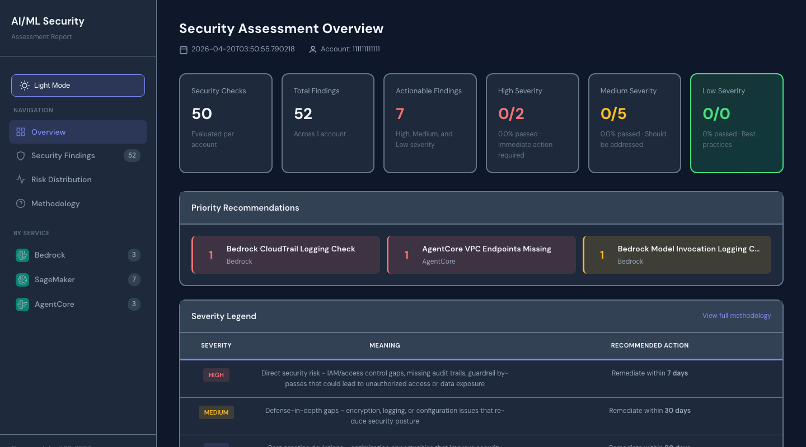
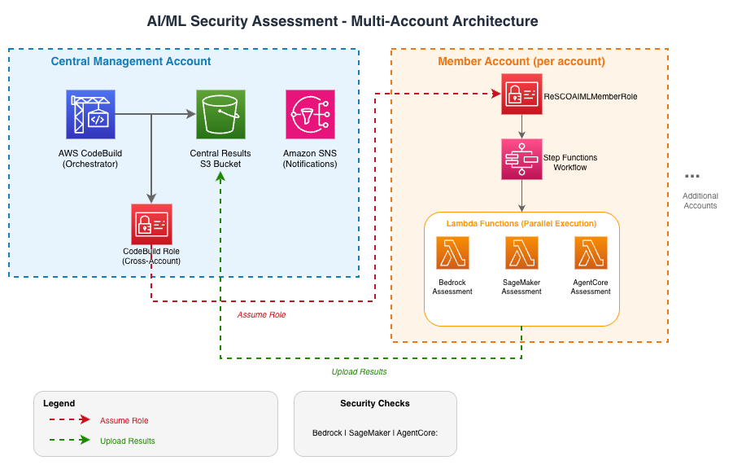

# AWS AI/ML Security Assessment for Amazon Bedrock, Amazon SageMaker AI, Amazon Bedrock AgentCore, and AWS Agent Registry

*A serverless framework based assessment that scans your AWS accounts for AI/ML security misconfigurations and produces an interactive, shareable report.*

[](https://opensource.org/licenses/MIT-0) [](https://www.python.org/downloads/) [](https://aws.amazon.com/serverless/sam/)

**Open-source automated security scanner for generative AI and machine learning workloads on AWS.** It brings together separate assessments for Amazon Bedrock, Amazon SageMaker AI, Amazon Bedrock AgentCore, and AWS Agent Registry. Core checks are guided by the [AWS Well-Architected Generative AI Lens](https://docs.aws.amazon.com/wellarchitected/latest/generative-ai-lens/generative-ai-lens.html). The optional **Responsible AI GRC** module adds technical checks for AI governance, risk, and compliance. Optional **OWASP Top 10 for LLM** checks extend coverage across common LLM security risks. Responsible AI GRC checks draw on the [AWS User Guide to Governance, Risk, and Compliance for Responsible AI Adoption](https://d1.awsstatic.com/whitepapers/compliance/AWS-User-Guide-Governance-Risk-Compliance-for-Responsible-AI-Adoption-Financial-Services.pdf).

Run **[208 checks](docs/SECURITY_CHECKS.md)** across AWS accounts and regions:

- **94 always-on core checks** for Amazon Bedrock, Amazon SageMaker AI, Amazon Bedrock AgentCore, and AWS Agent Registry
- **38 always-on Agentic AI Security checks**, synthesized from service findings and native AgentCore gateway checks
- **64 optional Responsible AI GRC checks** for selected technical controls informed by AWS governance, risk, and compliance guidance
- **12 optional OWASP Top 10 for LLM checks**, including mapping-based coverage and native system-prompt-leakage checks

Deploy in a single account or across AWS Organizations. Assessments support
multi-region execution within the standard AWS commercial partition and
produce interactive, shareable reports with severity ratings, filtering,
search, remediation references, and per-account/per-region views. Assessment
artifacts are stored in your AWS account; the deployment build pulls source
from the configured repository.

> **Scope note:** Responsible AI GRC provides selected AWS configuration checks for AI governance, risk, and compliance. It complements architectural reviews such as the AWS Well-Architected Responsible AI Lens and broader compliance programs. See [Responsible AI GRC scope, sources, and compatibility](docs/RESPONSIBLE_AI_GRC_SCOPE.md).

---

## See It In Action

The framework generates professional, interactive security assessment reports with filtering, search, and dark mode support.

**Download Sample Reports** | [Single Account](https://aws-samples.github.io/sample-aiml-security-assessment/sample-reports/security_assessment_single_account.html) | [Multi-Account](https://aws-samples.github.io/sample-aiml-security-assessment/sample-reports/security_assessment_multi_account.html)

<table>
  <tr>
    <td width="50%">
      
      <p align="center"><em>Executive Dashboard (Light Mode)</em></p>
    </td>
    <td width="50%">
      
      <p align="center"><em>Executive Dashboard (Dark Mode)</em></p>
    </td>
  </tr>
  <tr>
    <td colspan="2">
      
      <p align="center"><em>Interactive Findings Table with Filtering</em></p>
    </td>
  </tr>
</table>

### Key Features

- **Executive Summary** with severity counts and service breakdown
- **Priority Recommendations** highlighting critical issues requiring immediate attention
- **[208 Security Checks](docs/SECURITY_CHECKS.md)** across Amazon Bedrock, Amazon SageMaker AI, Amazon Bedrock AgentCore, AWS Agent Registry, Agentic AI Security, Responsible AI GRC, and OWASP Top 10 for LLM
- **Multi-Region Support** within the standard AWS commercial partition for core Bedrock, SageMaker, AgentCore, and AWS Agent Registry checks, with per-region risk breakdown
- **Interactive Filtering** by account, region, service, severity, and status
- **Light/Dark Mode Toggle** with persistent user preference
- **Text Search** across all findings with real-time results
- **Direct AWS Documentation Links** for each finding with remediation guidance
- **Multi-Account Support** with consolidated reporting across your organization
- **Fully Automated** deployment and execution through AWS CloudFormation and AWS CodeBuild

---

## Table of Contents

- [What It Does](#what-it-does)
- [Why Use This Framework?](#why-use-this-framework)
- [Scope and Limitations](#scope-and-limitations)
- [Quick Start](#quick-start)
- [Architecture](#architecture)
- [Prerequisites](#prerequisites)
- [Single-Account Deployment](#single-account-deployment)
- [Multi-Account Deployment](#multi-account-deployment)
- [Upgrading an Existing Deployment](#upgrading-an-existing-deployment)
- [How It Works](#how-it-works)
- [Permissions Required](#permissions-required)
- [Viewing Results](#viewing-results)
- [Customization](#customization)
- [Cleanup](docs/CLEANUP.md)
- [Documentation](#documentation)
- [Contributing](#contributing)
- [Security](#security)
- [License](#license)

---

## What It Does

This serverless assessment framework automatically evaluates your AI/ML workloads against AWS security best practices. It uses AWS serverless services to gather data from the control plane and generate reports containing the status of various security checks, severity levels, and recommended actions.

Designed for workloads using [Amazon Bedrock](https://aws.amazon.com/bedrock/), [Amazon Bedrock AgentCore](https://aws.github.io/bedrock-agentcore-starter-toolkit/), [AWS Agent Registry](https://docs.aws.amazon.com/bedrock-agentcore/latest/devguide/registry.html), [Amazon SageMaker AI](https://aws.amazon.com/sagemaker/ai/), or the optional Responsible AI GRC assessment.

### Why Use This Framework?

| Challenge | How This Framework Helps |
| --- | --- |
| **Manual security audits are time-consuming** | Fully automated scanning with one-click CloudFormation deployment |
| **Inconsistent security checks across teams** | Standardized 208-check assessment based on AWS Well-Architected Generative AI Lens and Agentic AI Lens best practices, AWS Responsible AI governance/risk/compliance guidance, and OWASP Top 10 for LLM |
| **Difficulty tracking AI/ML security posture** | Interactive HTML dashboards with severity breakdown and per-account visibility |
| **Multi-account complexity** | Consolidated reporting across AWS Organizations with cross-account role assumption |
| **Compliance and audit support** | Exportable reports to supplement your compliance program, with remediation guidance linked to AWS documentation |
| **Generative AI security gaps** | Purpose-built checks for LLM guardrails, model access controls, and prompt injection prevention |

**Services Covered:**

- **[Amazon Bedrock](docs/SECURITY_CHECKS.md#amazon-bedrock-security-checks-40)** (40 always-on core checks) - Covers guardrails, prompt-attack and image filtering, cross-account policies, data retention, inference profiles, automated reasoning and Marketplace endpoint encryption/networking, Amazon VPC endpoints, IAM permissions, agent guardrails and least privilege, logging, monitoring, evaluation, quotas, and Lambda code scanning.
- **[Amazon SageMaker AI](docs/SECURITY_CHECKS.md#amazon-sagemaker-ai-security-checks-29)** (29 always-on core checks) - Covers AWS Security Hub controls, internet and VPC exposure, encryption, isolation, GuardDuty AI Protection, HyperPod, Model Registry resource policies, MLOps, monitoring, approval, drift detection, deployment patterns, and lineage tracking. `SM-29` remains reserved for a deferred Unified Studio networking check; `SM-30` is implemented.
- **[Amazon Bedrock AgentCore](docs/SECURITY_CHECKS.md#amazon-bedrock-agentcore-security-checks-17)** (17 always-on core checks) - Covers runtime, Code Interpreter, and browser VPC isolation; Identity token-vault encryption; browser recording; memory, policy-engine, gateway encryption; observability; VPC endpoints; policies; and online evaluation.
- **[AWS Agent Registry](docs/SECURITY_CHECKS.md#aws-agent-registry-security-checks-8)** (8 always-on core checks) - Covers Registry IAM access, publication approval, discovery authorization, encryption, organization auto-detection, record lifecycle, and provenance.
- **[Agentic AI Security](docs/SECURITY_CHECKS.md#agentic-ai-security-checks-38)** (38 always-on checks) - Covers bounded autonomy, agent identity and access, tool authorization, Registry governance and provenance, guardrail enforcement, prompt/input protection, memory privacy, auditability and continuous assurance, and abuse/cost protection. Maps selected Amazon Bedrock, Amazon Bedrock AgentCore, and AWS Agent Registry findings into the [AWS Well-Architected Agentic AI Lens](https://docs.aws.amazon.com/wellarchitected/latest/agentic-ai-lens/agentic-ai-lens.html) view and adds native AgentCore gateway checks.
- **[Responsible AI GRC](docs/SECURITY_CHECKS.md#responsible-ai-grc-checks-64-additional-5-upstream-extensions)** (64 opt-in checks) - Covers unbounded consumption, excessive agency, supply chain, training data poisoning, vector weaknesses, non-compliant output, misinformation, harmful or biased output, PII disclosure, hallucination, prompt injection, improper output handling, off-topic output, and out-of-date training data. Enable with `EnableResponsibleAIGRCAssessment`; checks are derived from the [AWS User Guide to Governance, Risk, and Compliance for Responsible AI Adoption](https://d1.awsstatic.com/whitepapers/compliance/AWS-User-Guide-Governance-Risk-Compliance-for-Responsible-AI-Adoption-Financial-Services.pdf).
- **[OWASP Top 10 for LLM](docs/SECURITY_CHECKS.md#owasp-top-10-for-llm-checks-12)** (12 opt-in checks) - Covers LLM01 through LLM10 by mapping existing Amazon Bedrock, Amazon SageMaker AI, Amazon Bedrock AgentCore, and Responsible AI GRC findings, plus two native LLM07 checks for system prompt leakage. AWS Agent Registry findings are intentionally excluded because the current Registry controls do not directly establish an OWASP LLM01–LLM10 control. Enable with `EnableOWASPAssessment`; results align to the [OWASP Top 10 for LLM 2025](https://genai.owasp.org/llm-top-10/) and render in the "By Compliance Standard" report section. When needed, this also runs Responsible AI GRC as a hidden source dependency.

**Deployment Options:**

- **Single-Account**: Assess security in one AWS account
- **Multi-Account**: Scan entire AWS Organizations with consolidated reporting

**How It Works:**

1. Deploy through AWS CloudFormation (one-click deployment)
2. Framework automatically scans your AI/ML resources
3. Generates interactive HTML reports stored in your Amazon S3 bucket
4. All data stays in your AWS account - no external dependencies

---

## Scope and Limitations

This tool operates within the [AWS Shared Responsibility Model](https://aws.amazon.com/compliance/shared-responsibility-model/). It assesses **your configuration responsibilities** (IAM policies, encryption settings, network isolation, logging) for AI/ML services. It does not assess AWS-managed infrastructure, physical security, or the underlying service platform.

**Point-in-time assessment.** Each run captures your security posture at the moment of execution. Resource configurations can change immediately after an assessment completes. Run assessments regularly and after significant changes to maintain visibility.

**No guarantee of security or compliance.** This framework identifies common misconfigurations based on AWS best practices and the AWS Well-Architected Framework. It does not cover all possible security risks, does not replace formal compliance audits (SOC 2, HIPAA, and similar), and does not guarantee that your workloads are secure. Use the results as one input into your broader security program.

**208 checks across seven areas.** The assessment covers Amazon Bedrock, Amazon SageMaker AI, Amazon Bedrock AgentCore, AWS Agent Registry, always-on Agentic AI Security, optional Responsible AI GRC checks, and optional OWASP Top 10 for LLM checks. Other AI/ML services (Amazon Comprehend, Amazon Rekognition, Amazon Textract, and others) are not currently assessed.

**AWS partition support.** The deployment and assessment are validated only in
the standard AWS commercial partition (`aws`). AWS GovCloud (US)
(`aws-us-gov`) and AWS China (`aws-cn`) are not currently validated or
supported. Partition-aware ARN handling and region discovery in parts of the
codebase do not constitute end-to-end support for those partitions.

---

## Quick Start

- **Single-Account**: Jump to [Single-Account Deployment](#single-account-deployment)
- **Multi-Account**: Jump to [Multi-Account Deployment](#multi-account-deployment)

## Architecture



## Prerequisites

- Python 3.12 — [Install Python](https://www.python.org/downloads/)
- AWS SAM CLI — [Install the AWS SAM CLI](https://docs.aws.amazon.com/serverless-application-model/latest/developerguide/serverless-sam-cli-install.html)
- Docker (optional) — [Install Docker](https://hub.docker.com/search/?type=edition&offering=community) — Only required for local development

---

## Single-Account Deployment

1. Download the [aiml-security-single-account.yaml](deployment/aiml-security-single-account.yaml) CloudFormation template.
2. **[Deploy to AWS CloudFormation](https://console.aws.amazon.com/cloudformation/home#/stacks/create/template?stackName=aiml-security-single-account)**
3. Upload the template and provide a stack name.
4. Optionally specify your email address to receive notifications.
5. **(Optional) Multi-Region**: Set `TargetRegions` to scan multiple regions:

   - Leave empty to scan only the deployment region (default)
   - Comma- or space-separated list (for example, `us-east-1,us-west-2,eu-west-1` or `us-east-1 us-west-2 eu-west-1`)
   - `all` to scan assessed-service regions in the standard AWS commercial partition

6. Review the optional [security policy baselines](#optional-security-policy-baselines), especially the Marketplace endpoint CMK requirement, which defaults to enabled.
7. Acknowledge IAM capabilities and click **Submit**.
8. Once complete, CodeBuild automatically runs the assessment.
9. View results: go to the stack **Outputs** tab → copy `AssessmentBucket` → open the report under the `/{account_id}/` prefix in that S3 bucket.

> **Tip**: The deployment creates two stacks. Your results are in the stack *you named*, not the auto-generated `aiml-sec-*` stack. See [Troubleshooting](docs/TROUBLESHOOTING.md#11-confused-by-multiple-cloudformation-stacks) for details.

---

## Multi-Account Deployment

### Step 1: Deploy Member Roles

Deploy [1-aiml-security-member-roles.yaml](deployment/1-aiml-security-member-roles.yaml) to all target accounts using CloudFormation StackSets with service-managed permissions.

1. Navigate to **CloudFormation** > **StackSets** in the AWS Organizations management account or delegated administrator account
2. Upload the template and set `ManagementAccountID` to the account ID where the central multi-account CodeBuild project runs
3. Select **Service-managed permissions** and target your OUs
4. Select your target region and submit

### Step 2: Deploy Central Infrastructure

Deploy [2-aiml-security-codebuild.yaml](deployment/2-aiml-security-codebuild.yaml) in your central assessment account. This can be your AWS Organizations management account or a delegated administrator/central tooling account.

1. Upload the template and set `MultiAccountScan` to `true`
2. Optionally set `TargetRegions` for multi-region scanning
3. Optionally provide an email address for notifications
4. Configure the optional [security policy baselines](#optional-security-policy-baselines); the central values are propagated to every per-account SAM deployment
5. Acknowledge IAM capabilities and submit
6. Stack creation automatically triggers the assessment across all accounts

---

## Upgrading an Existing Deployment

The required upgrade steps depend on which files changed. For a code-only fix,
running the existing CodeBuild project is normally sufficient. The top-level
CloudFormation templates and multi-account member-role StackSet only need to be
updated when the corresponding templates changed.

| Files changed in the target release | Required action |
| --- | --- |
| `aiml-security-assessment/functions/**`, `aiml-security-assessment/statemachine/**`, either AWS SAM `template*.yaml`, Lambda `requirements.txt`, `buildspec.yml`, or `consolidate_html_reports.py` | Run CodeBuild so it builds and updates the AWS SAM assessment stack |
| `deployment/aiml-security-single-account.yaml` | Update the single-account infrastructure stack |
| `deployment/1-aiml-security-member-roles.yaml` | Update every targeted multi-account member-role StackSet instance before running CodeBuild |
| `deployment/2-aiml-security-codebuild.yaml` | Update the multi-account central infrastructure stack |
| Only documentation, tests, examples, or GitHub workflow files | No deployed-resource update is required |

Use the templates and source from the same release. `GitHubBranch` accepts a
branch, tag, or commit; an immutable release tag or commit is recommended for
reproducible deployments.

### Determine what changed

Check [CHANGELOG.md](CHANGELOG.md) first. Its `Unreleased` or target-version
`Deployment impact` section identifies the required actions. If the changelog
does not cover the exact revisions being compared, infer the actions directly
from the repository by comparing the commit used by the last successful build
with the target revision:

```bash
git diff --name-only <deployed-commit>..<target-tag-or-commit> -- \
  deployment/ \
  aiml-security-assessment/ \
  buildspec.yml \
  consolidate_html_reports.py
```

For a branch such as `main`, use the resolved source commit shown by the last
successful CodeBuild execution—not merely the branch name—as
`<deployed-commit>`.

If the deployment is pinned to a tag or commit, update the infrastructure
stack's `GitHubBranch` parameter before starting CodeBuild. When its
CloudFormation template did not change, this can be a parameter-only update
using the current template. A deployment tracking a moving branch such as
`main` can pull the latest code by starting CodeBuild without a stack update.

### Single-account upgrade

1. If [aiml-security-single-account.yaml](deployment/aiml-security-single-account.yaml)
   changed, update the existing infrastructure stack by replacing its template
   with the target release's version. Do not create a second stack.
2. If the source is pinned, update `GitHubRepoUrl` or `GitHubBranch` as needed.
   If the infrastructure template did not change, use the current template and
   change only these parameters.
3. Preserve all other parameter values unless intentionally changing the
   assessment configuration.
4. For a template update, review the change set, including IAM changes,
   acknowledge `CAPABILITY_NAMED_IAM`, and wait for `UPDATE_COMPLETE`.
5. If deployable assessment code changed, manually start CodeBuild and confirm
   that it updates the existing `aiml-sec-{account_id}` AWS SAM stack.

### Multi-account upgrade

Perform only the applicable steps, in this order:

1. If [1-aiml-security-member-roles.yaml](deployment/1-aiml-security-member-roles.yaml)
   changed, update the existing CloudFormation StackSet with the target
   release's template. Preserve `ManagementAccountID`, deployment targets,
   regions, and other settings. Wait until every targeted StackSet instance
   reports success.
2. If [2-aiml-security-codebuild.yaml](deployment/2-aiml-security-codebuild.yaml)
   changed, update the existing central infrastructure stack by replacing its
   template with the target release's version.
3. If the source is pinned, update `GitHubRepoUrl` or `GitHubBranch` as needed.
   If the central template did not change, use the current template and change
   only these parameters.
4. Preserve all other parameter values unless deliberately changing the
   deployment. For a template update, review IAM changes, acknowledge
   `CAPABILITY_NAMED_IAM`, and wait for `UPDATE_COMPLETE`.
5. If deployable assessment code changed, manually start CodeBuild and confirm
   that it updates the existing per-account AWS SAM stacks.

When the member-role template changed, update it before CodeBuild runs so the
central build uses the release's intended cross-account deployment, execution
polling, and report-retrieval permissions. Assessment API permissions are
deployed on the SAM-created Lambda execution roles.

The custom resource in the infrastructure templates starts CodeBuild only when
the infrastructure stack is initially created. It does not start a new build
for stack updates, so manually start CodeBuild whenever deployable assessment
code needs to be applied.

Users who deployed the AWS SAM templates directly, without the top-level
CloudFormation templates, must build and deploy the new release's
`aiml-security-assessment/template.yaml` or
`aiml-security-assessment/template-multi-account.yaml` to the existing stack
name while preserving its parameter values.

For verification and additional detail, see
[Upgrading to a New Release](docs/TROUBLESHOOTING.md#upgrading-to-a-new-release).

---

## Optional Security Policy Baselines

The deployment templates expose organization-specific baselines for checks that
cannot infer your intended trust or hardening policy. Defaults preserve advisory
behavior except for Marketplace endpoint customer-managed encryption, which is
enforced by default.

| CloudFormation parameter | Default | Affected check | Behavior |
| --- | --- | --- | --- |
| `RequireBedrockZeroDataRetention` | `false` | BR-37 | When `true`, the Bedrock account retention modes `default` and `inherit` fail the explicit zero-data-retention baseline. `provider_data_share` fails regardless of this setting. |
| `RequireMarketplaceEndpointCMK` | `true` | BR-40 | When `true`, a Bedrock Marketplace model endpoint without a customer-managed KMS key fails. BR-40 uses `kms:DescribeKey` and requires `KeyManager=CUSTOMER`; AWS-managed keys do not pass. When `false`, a missing or AWS-managed key is reported as an informational `N/A` hardening advisory. |
| `RequireAgentCoreOnlineEvaluation` | `false` | AC-17 | When `true`, missing or incomplete active AgentCore online evaluation coverage fails. When `false`, absent coverage is informational. |
| `RequireAgentRegistryManualApproval` | `false` | AR-03 | When `true`, Agent Registry instances configured to approve all submitted records fail. When `false`, automatic approval is reported as an informational governance advisory. |
| `RequireAgentRegistryCMK` | `false` | AR-05 | When `true`, registries using the default AWS owned encryption key fail. When `false`, AWS owned key encryption is reported as an informational hardening advisory; registries with a customer-managed KMS key pass. |
| `AgentCoreTokenVaultId` | `default` | AC-14 | Selects the regional AgentCore Identity token vault whose customer-managed KMS encryption is assessed. |
| `ApprovedExternalAccountIds` | Empty | SM-30 | Comma-separated 12-digit AWS account IDs approved to receive SageMaker Model Registry access. Accounts outside the configured boundary fail. |
| `ApprovedOrganizationIds` | Empty | SM-30 | Comma-separated AWS Organizations IDs approved to receive SageMaker Model Registry access. Organizations outside the configured boundary fail. |

For the approved-account and approved-organization lists, do not include spaces.
Leaving both lists empty means SM-30 still detects public access, but external
sharing that cannot be compared with an explicit organizational boundary is
reported informationally.

When updating a stack with the AWS CLI, use a JSON parameter file for these
comma-separated values. The CLI shorthand syntax also uses commas as field
separators, so an unescaped `ParameterValue=111122223333,444455556666` is not
treated as one value.

Create `params.json`:

```json
[
  {
    "ParameterKey": "ApprovedExternalAccountIds",
    "ParameterValue": "111122223333,444455556666"
  },
  {
    "ParameterKey": "ApprovedOrganizationIds",
    "ParameterValue": "o-a1b2c3d4e5,o-f6g7h8i9j0"
  }
]
```

Then pass the file to the stack update:

```bash
aws cloudformation update-stack \
  --stack-name <stack-name> \
  --use-previous-template \
  --capabilities CAPABILITY_NAMED_IAM \
  --parameters file://params.json
```

These parameters are available in both top-level deployment templates and both
direct SAM templates. CodeBuild passes the selected values to every deployed
assessment stack. Updating a value requires a CloudFormation stack update and a
new assessment run.

---

## Multi-Region Scanning

Both deployment modes support scanning multiple AWS regions in parallel via the `TargetRegions` parameter:

| Value | Behavior |
| --- | --- |
| Empty (default) | Scans deployment region only — fully backward compatible |
| Comma- or space-separated (for example, `us-east-1,us-west-2` or `us-east-1 us-west-2`) | Scans those regions in parallel |
| `all` | Discovers assessed-service regions in the standard AWS commercial partition. For newer services such as AgentCore and AWS Agent Registry that do not publish endpoint-region metadata, scans the commercial partition region catalog and reports unsupported regions as informational `N/A` |

Scanning uses a Step Functions Map state and runs up to `MaxRegionConcurrency`
regions concurrently. This reduces elapsed time compared with sequential
scanning, although total duration and AWS API usage still depend on the number
of regions and resources assessed. Services unavailable in a region produce an
informational N/A finding.

`TargetRegions` selects regions within the supported commercial partition; it
does not enable cross-partition deployment or establish support for GovCloud
or China regions.

The HTML report includes a Region column, filter dropdown, and "Risk by Region / Scope" summary.

> **Changing an existing deployment to multi-region?** See
> [Troubleshooting](docs/TROUBLESHOOTING.md#12-upgrading-an-existing-deployment-to-multi-region).
> This is a parameter-only change. For a new software release, follow the full
> [upgrade procedure](#upgrading-an-existing-deployment).

---

## How It Works

1. **Deploy** — CloudFormation creates CodeBuild, S3, IAM roles, and a Lambda trigger
2. **CodeBuild runs** — builds and deploys the SAM assessment stack (per account in multi-account mode)
3. **Step Functions execute** — orchestrates: S3 cleanup → IAM permission caching → resolve regions → Map state fans out across regions. Within each region, Bedrock, SageMaker, AgentCore, and AWS Agent Registry run in parallel; Responsible AI GRC runs once from the first region when either Responsible AI GRC or OWASP requires its source rows; OWASP then runs per region when enabled → generate consolidated report
4. **Results** — HTML and CSV reports are stored in your S3 bucket

### Optional: Responsible AI GRC Checks (`EnableResponsibleAIGRCAssessment`)

The 64 Responsible AI GRC (FS-XX) checks are **opt-in** and default
to `false`. Set the `EnableResponsibleAIGRCAssessment` deployment parameter to `true`
when you want the additional Responsible AI GRC assessment. When
enabled, the Responsible AI GRC assessment Lambda runs and its findings appear in a
dedicated **Responsible AI GRC** section of the HTML report. When left `false`
and OWASP is also disabled, no Responsible AI GRC findings are produced and the
report omits that section entirely. The toggle is threaded into the Step
Functions execution input (`enableResponsibleAIGRC`); the Responsible AI GRC
Lambda is always deployed and is invoked when either `enableResponsibleAIGRC`
or `enableOWASP` is `true`. In the OWASP-only case, its FS-* findings are hidden
source rows rather than a customer-visible Responsible AI GRC section. A legacy
`EnableFinServAssessment` parameter is also available as an alias — see
[Responsible AI GRC alias migration guide](docs/RESPONSIBLE_AI_GRC_ALIAS_MIGRATION.md).

> **Deployment path note.** The `EnableResponsibleAIGRCAssessment` parameter is wired
> through the CodeBuild-based deployment templates
> (`deployment/aiml-security-single-account.yaml` and
> `deployment/2-aiml-security-codebuild.yaml`), which thread it into every Step
> Functions `start-execution` call as `enableResponsibleAIGRC`. This is the supported
> install path. If you instead deploy `aiml-security-assessment/template.yaml`
> directly with `sam deploy` and start executions yourself, the state machine has
> no built-in trigger, so Responsible AI GRC checks stay **off** unless you include
> `"enableResponsibleAIGRC": "true"` in the execution input you pass to `StartExecution`.

### Optional: OWASP Top 10 for LLM Checks (`EnableOWASPAssessment`)

The 12 OWASP Top 10 for LLM (OW-XX) checks are **opt-in** and default to
`false`. Set the `EnableOWASPAssessment` deployment parameter to `true` when
you want the additional compliance-standard assessment. When enabled, the OWASP
Lambda runs per region after the Bedrock/SageMaker/AgentCore/AWS Agent Registry/Responsible AI GRC Lambdas
complete: it reads Bedrock, SageMaker, and AgentCore per-region CSVs plus the
Responsible AI GRC execution-scoped CSV when needed, applies mapping rules to emit
OW-01..OW-10 rows derived from existing findings, and runs two net-new checks
for LLM07 (System Prompt Leakage). Findings appear in a new **"By Compliance
Standard"** sidebar section of the HTML report. When left `false`, no OWASP
findings are produced and the section is omitted entirely. The toggle is
threaded into the Step Functions execution input (`enableOWASP`); the OWASP
Lambda is always deployed but is invoked only when the flag is `true`.

> **OWASP → Responsible AI GRC dependency (transparent to users).** Roughly
> two-thirds of the OWASP mapping rows — including all of LLM05 (Improper
> Output Handling) — derive from the Responsible AI GRC (FS-XX) checks. To
> guarantee **full** OWASP coverage, the state machine automatically runs the
> Responsible AI GRC Lambda whenever `EnableOWASPAssessment=true`, even when
> `EnableResponsibleAIGRCAssessment=false`. When the customer did not enable
> Responsible AI GRC explicitly, its findings are used only to power the
> OW-XX mappings, are **hidden from the report UI** — no Responsible AI GRC
> nav item, service card, or section appears — and the raw
> `responsible_ai_grc_security_report_*.csv` is not copied to the
> customer-facing report bucket. Setting both flags to `true` surfaces the
> Responsible AI GRC section and CSV normally.

The "By Compliance Standard" section is **extensible**: adding NIST AI RMF (`EnableNISTAssessment`) or EU AI Act (`EnableEUAIActAssessment`) later follows the same pattern.

#### Scope and limitations

- **Responsible AI GRC Region scope.** Core Bedrock, SageMaker, AgentCore, and AWS Agent Registry checks run per target region. Responsible AI GRC runs once per account; evidence without explicit regional provenance is labeled `Global` rather than copied into every target region. Regions confirmed to have no relevant GenAI resources receive an explicit regional `FS-00`/`N/A` row.
- **Heuristic and advisory checks.** Some controls cannot be verified through an API (application-layer controls, dataset contents, resource associations); these are reported as `ADVISORY`/`N/A` and require manual review. See [How finding severities are determined](#how-finding-severities-are-determined).
- **Permissions.** A check that lacks an IAM permission is reported as `COULD NOT ASSESS` (not a failure). Re-run CodeBuild after updating either SAM template so the revised per-Lambda execution roles are deployed. Update the member-role StackSet only when `deployment/1-aiml-security-member-roles.yaml` itself changes.

For detailed architecture, execution flow, and extension guidance, see the [Developer Guide](docs/DEVELOPER_GUIDE.md).

---

## Viewing Results

1. Open your **infrastructure stack** in CloudFormation → **Outputs** tab → copy `AssessmentBucket`
2. Navigate to that S3 bucket
3. For single-account, open `{account_id}/security_assessment_single_account_*.html`
4. For multi-account, open `consolidated-reports/security_assessment_multi_account_*.html`

### Assessment Execution Process

#### Automatic Trigger

- The AWS CodeBuild project starts automatically after central stack creation
- An AWS Lambda trigger function initiates the assessment workflow

#### Multi-Account Orchestration

1. **Account Discovery**: AWS CodeBuild queries AWS Organizations for active accounts
2. **Role Assumption**: Assumes `AIMLSecurityMemberRole` in each target account
3. **Module Deployment**: Deploys the AI/ML assessment module:

   - Amazon Bedrock Assessment AWS Lambda
   - Amazon SageMaker AI Assessment AWS Lambda
   - Amazon Bedrock AgentCore Assessment AWS Lambda
   - Responsible AI GRC Assessment AWS Lambda
   - OWASP Top 10 for LLM Assessment AWS Lambda
   - Amazon S3 Cleanup AWS Lambda
   - AWS IAM Permission Caching AWS Lambda
   - Region Resolution AWS Lambda
   - Consolidated Report Generation AWS Lambda

4. **Assessment Execution**: AWS Step Functions orchestrate parallel AWS Lambda execution
5. **Results Collection**: Individual AWS Lambda functions store results in local Amazon S3 buckets
6. **Consolidation**: AWS CodeBuild collects and consolidates results from all accounts
7. **Reporting**: Generates multi-account HTML and CSV reports
8. **Notification**: Sends completion notification through Amazon SNS (if configured)

## Monitoring and Results

- **Amazon S3 Bucket**: Central storage for all assessment results
- **Amazon CloudWatch Logs**: AWS CodeBuild execution logs
- **Amazon SNS Notifications**: Email alerts on completion/failure
- **Amazon EventBridge Rules**: Automated workflow triggers

You can check the AWS CodeBuild console to confirm the assessment completed successfully before accessing the results.

### Accessing Results

1. **Find the Amazon S3 Bucket Name**:

   - Navigate to **AWS CloudFormation** > **Stacks** in the AWS Console
   - For single-account deployments using the standalone template (`aiml-security-single-account.yaml`), select the stack you deployed (for example, `aiml-security-single-account`) and find the `AssessmentBucket` output. Results are synced to this bucket under the `{account_id}/` prefix.
   - For multi-account deployments, select the `aiml-security-multi-account` stack created in [Step 2: Deploy Central Infrastructure](#step-2-deploy-central-infrastructure) and find the `AssessmentBucket` output
   - Go to the **Outputs** tab
   - Copy the Amazon S3 bucket name

   > **Note**: The deployment creates multiple Amazon S3 buckets. Only use the bucket from the `AssessmentBucket` output above. Other buckets (such as `aiml-sec-*-aimlassessmentbucket-*` from nested stacks or `aws-sam-cli-managed-*` for deployment artifacts) are for internal use and can be ignored.

2. **Navigate to the Amazon S3 Bucket**:

   - Go to **Amazon S3** in the AWS Console
   - Search for and open your assessment bucket
   - For single-account deployments, open the `{account_id}/` folder and then open the `security_assessment_single_account_YYYYMMDD_HHMMSS.html` report
   - For multi-account deployments, follow the [Report Structure](#report-structure) guidance below

### Report Structure

#### Consolidated Reports

- **Location**: `consolidated-reports/` folder in the bucket
- **Content**: Multi-account HTML report combining all account assessments
- **File Format**: `security_assessment_multi_account_YYYYMMDD_HHMMSS.html`
- **Features**:

  - Executive summary with metrics (Total, High, Medium, Low severity counts)
  - Service, Agentic AI lens, Responsible AI GRC, and OWASP compliance views
  - Priority recommendations
  - Light/dark mode toggle (persists through localStorage)
  - Dropdown filters for Account ID, Region, Service, Severity, Status
  - Text search filter for findings
  - "View Docs" buttons for reference links

#### Individual Account Reports

- **Location**: Folders named with account IDs (for example, `123456789012/`)
- **Content**: Account-specific CSV and HTML files for AI/ML assessments
- **Files Include**:

  - `bedrock_security_report_{execution_id}_{region}.csv` - Amazon Bedrock security assessment results
  - `sagemaker_security_report_{execution_id}_{region}.csv` - Amazon SageMaker AI security assessment results
  - `agentcore_security_report_{execution_id}_{region}.csv` - Amazon Bedrock AgentCore security assessment results
  - `agent_registry_security_report_{execution_id}_{region}.csv` - AWS Agent Registry security assessment results
  - `responsible_ai_grc_security_report_{execution_id}.csv` - Responsible AI
    GRC risk assessment results (64 FS-XX checks; present in the report bucket
    only when `EnableResponsibleAIGRCAssessment` is enabled)
  - `owasp_security_report_{execution_id}_{region}.csv` - OWASP Top 10 for LLM
    assessment results (12 OW-XX checks; present only when
    `EnableOWASPAssessment` is enabled)
  - `permissions_cache_{execution_id}.json` - IAM permissions cache
  - `security_assessment_single_account_{timestamp}.html` - Consolidated HTML report (same features as multi-account report)

### Understanding Results

| Severity | Meaning |
| --- | --- |
| **High** | Critical — immediate action required |
| **Medium** | Important — should be addressed |
| **Low** | Minor — best practice optimization |
| **Informational** | Advisory — no action required |

| Status | Meaning |
| --- | --- |
| **Failed** | Security issue identified |
| **Passed** | Resource meets best practice |
| **N/A** | Not applicable, advisory/manual review, unavailable API or region, or assessment could not determine a result |

---

### How finding severities are determined

Responsible AI GRC (`FS-`) check severities are assigned by a documented, reproducible methodology rather than per-check intuition. Each control is scored on two axes — **Impact** (harm if the control is absent) and **Likelihood** (probability the adverse outcome occurs given the control is absent) — and the pair is mapped to a severity via a 3×3 matrix. The labels align with the **AWS Security Hub ASFF** severity scale, so findings can be forwarded to Security Hub with consistent severities:

| Label | ASFF normalized | Meaning |
| --- | --- | --- |
| Informational | 0 | No actionable issue (control not applicable, advisory/manual-review, or could-not-assess context) |
| Low | 1–39 | Does not require action on its own; compensating controls exist |
| Medium | 40–69 | Should be addressed, but not urgently |
| High | 70–89 | Should be addressed as a priority |

Severity is a property of the **control** (its inherent risk), so a check's `Passed` and `Failed` rows carry the same severity. The `N/A` family is fixed by disposition: *not-applicable* and *advisory* findings are **Informational**; *could-not-assess* (access-denied / unsupported region) findings are **Low**. `Critical` is reserved and not currently emitted.

For the full methodology (matrix, factor definitions, disposition rules) and the authoritative per-finding assignments, see [Responsible AI GRC Severity Methodology](docs/SECURITY_CHECKS_RESPONSIBLE_AI_GRC_SEVERITY_METHODOLOGY.md) and the [Responsible AI GRC Severity Register](docs/SECURITY_CHECKS_RESPONSIBLE_AI_GRC_SEVERITY_REGISTER.md). Mappings are preliminary — validate with your MRM/Legal/Compliance teams before relying on them as audit evidence.

## Customization

| Task | How |
| --- | --- |
| Add new accounts | Add to StackSet deployment targets |
| Modify assessment runtime permissions | Edit the specific Lambda policy in both SAM templates |
| Modify deployment or cross-account permissions | Edit the applicable `deployment/*.yaml` template |
| Adjust concurrency | Change `ConcurrentAccountScans` parameter |
| Add new service checks | See [Developer Guide](docs/DEVELOPER_GUIDE.md#adding-new-aiml-service-assessments) |

---

## Permissions Required

The deployment uses multiple IAM roles with different trust and permission boundaries. They are not all read-only.

- **`CodeBuildRole` / `MultiAccountCodeBuildRole`**: orchestration roles used by the infrastructure stack to clone the repo, build SAM, deploy/update or recover failed assessment stacks, and start Step Functions executions. These roles require infrastructure-management permissions such as CloudFormation, Lambda, IAM, Step Functions, and S3 actions.
- **`AIMLSecurityMemberRole`**: role assumed only in target accounts during multi-account runs. It is limited to deploying, updating, or recovering failed assessment stacks, polling Step Functions executions, and retrieving report artifacts. It does **not** receive Bedrock, SageMaker, AgentCore, or other assessment-service read permissions.
- **SAM-created Lambda execution roles**: runtime roles for the assessment functions. These are the closest thing to read-only assessment roles. They primarily use `List*`, `Describe*`, and `Get*` access against Bedrock, SageMaker, AgentCore, AWS Agent Registry (`agent-registry:ListRegistries`, `agent-registry:GetRegistry`, `agent-registry:ListRegistryRecords`), IAM analysis APIs, and supporting read APIs, plus S3 access to write reports and read the cached IAM permissions file.

If you need to reduce scope, review the role policies in:

- [deployment/aiml-security-single-account.yaml](deployment/aiml-security-single-account.yaml)
- [deployment/1-aiml-security-member-roles.yaml](deployment/1-aiml-security-member-roles.yaml)
- [deployment/2-aiml-security-codebuild.yaml](deployment/2-aiml-security-codebuild.yaml)
- [aiml-security-assessment/template.yaml](aiml-security-assessment/template.yaml)
- [aiml-security-assessment/template-multi-account.yaml](aiml-security-assessment/template-multi-account.yaml)

---

## Documentation

| Document | Description |
| --- | --- |
| [Changelog](CHANGELOG.md) | User-facing changes and required deployment actions for unreleased work and tagged versions |
| [Security Checks Reference](docs/SECURITY_CHECKS.md) | Complete reference for all 208 security checks with severity levels |
| [OWASP Top 10 for LLM Checks](docs/SECURITY_CHECKS_OWASP.md) | Complete OW-01..12 reference: mapping-derived OWASP LLM01..LLM10 rows, native LLM07 checks, source dependencies, references, and status semantics |
| [Responsible AI GRC Scope](docs/RESPONSIBLE_AI_GRC_SCOPE.md) | What Responsible AI GRC is and is not, its relationship to the AWS Well-Architected Responsible AI Lens, the per-bucket source catalog, check-count reconciliation, terminology, and the compatibility policy for preserved identifiers |
| [Responsible AI GRC Checks](docs/SECURITY_CHECKS_RESPONSIBLE_AI_GRC.md) | Complete FS-01..69 reference: shared introduction, severity rubric, upstream-overlap table, compliance framework mapping, and all check definitions (Part 1 infrastructure controls, Part 2 guardrails & content safety, Part 3 app-layer controls & gaps) |
| [Responsible AI GRC Severity Methodology](docs/SECURITY_CHECKS_RESPONSIBLE_AI_GRC_SEVERITY_METHODOLOGY.md) | Likelihood × Impact → ASFF severity model, disposition rules, and research basis for FS check severities |
| [Responsible AI GRC Severity Register](docs/SECURITY_CHECKS_RESPONSIBLE_AI_GRC_SEVERITY_REGISTER.md) | Authoritative per-finding severity assignments (the single source of truth enforced by the drift-guard test) |
| [Responsible AI GRC Compliance Mappings](docs/SECURITY_CHECKS_RESPONSIBLE_AI_GRC.md#compliance-framework-mapping) | Preliminary mapping of FS checks to SR 11-7, FFIEC CAT, NYDFS 500, PCI-DSS, DORA, MAS TRM, ISO 27001, ECOA, and OWASP LLM Top 10 |
| [Troubleshooting Guide](docs/TROUBLESHOOTING.md) | Common issues, stack identification, upgrade guide, debugging |
| [Developer Guide](docs/DEVELOPER_GUIDE.md) | Architecture details, adding custom checks, and contributing |
| [Cleanup Guide](docs/CLEANUP.md) | Step-by-step resource removal instructions |

---

## CI/CD

GitHub Actions workflows run automatically on pull requests and selected pushes:

| Workflow | Trigger | What It Checks |
| --- | --- | --- |
| **Python Code Quality** | PR | `ruff check` and `ruff format --check` on changed Python files |
| **AI/ML Security Assessment Tests** | PR, push to `main`/`develop` | Runs the `pytest` suite (assessment functions and report pipeline) on Python 3.12 |
| **CloudFormation Lint** | PR | Validates deployment and SAM templates with `cfn-lint` |
| **SAM Validate & Build** | PR | `sam validate --lint` and `sam build` on SAM templates |
| **ASH Security Scan** | PR | Scans for secrets, dependency vulnerabilities, and IaC misconfigurations |
| **ASH Full Repository Scan** | Push to main, monthly | Full repository security scan |

---

## Contributing

We welcome community contributions! See the [Developer Guide](docs/DEVELOPER_GUIDE.md) for guidelines.

## Security

See [CONTRIBUTING](CONTRIBUTING.md#security-issue-notifications) for reporting security issues.

## License

This library is licensed under the MIT-0 License. See the [LICENSE](LICENSE) file.
