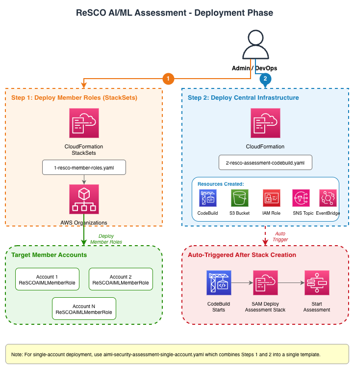
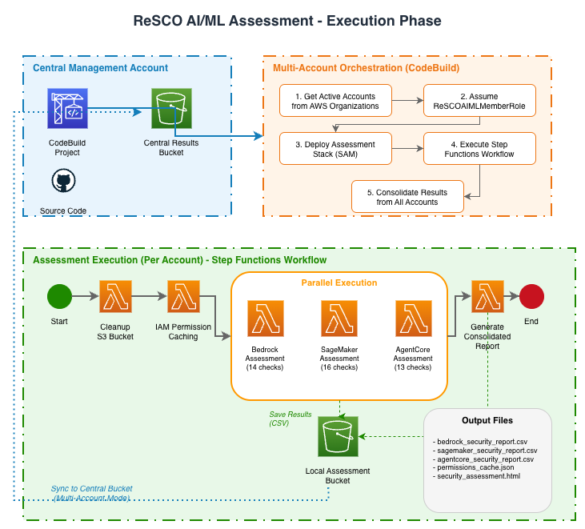
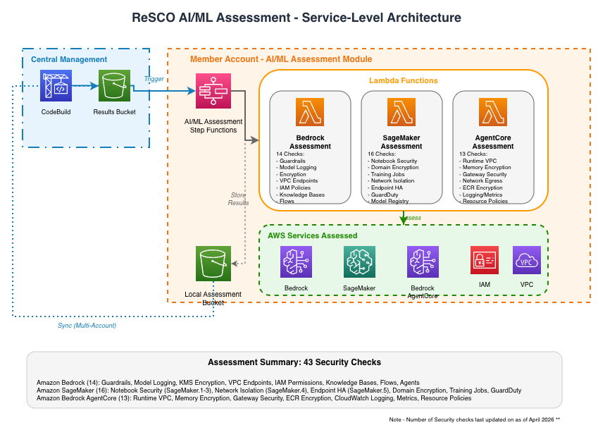
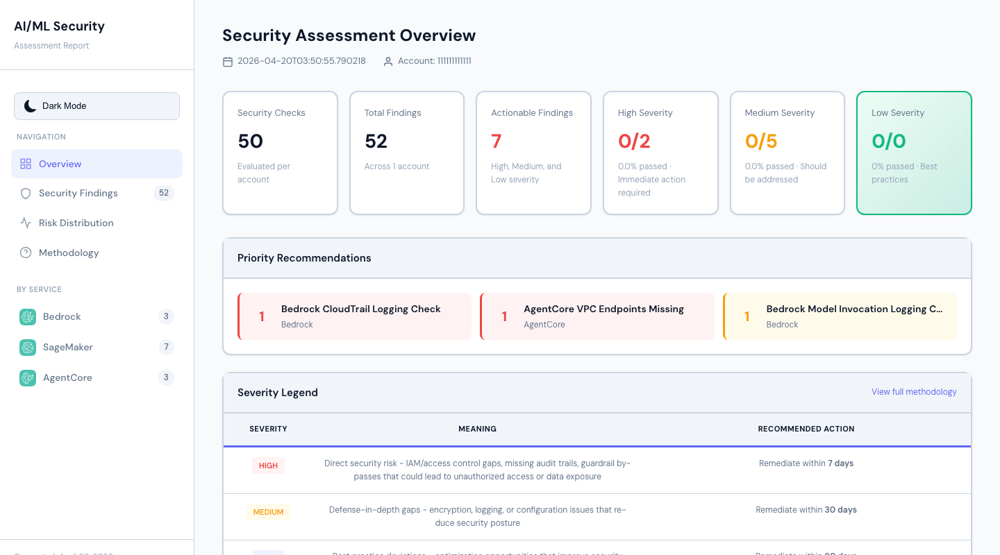
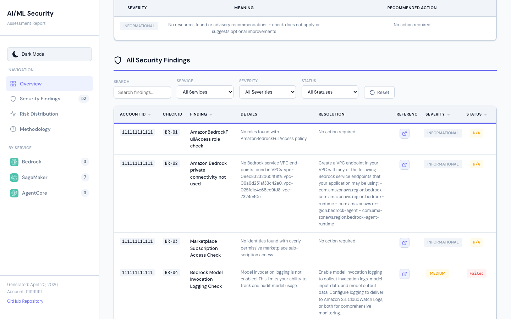

# AI/ML Security Assessment Framework - Developer Guide

## Table of Contents

- [Agentic Development](#agentic-development)
- [Architecture Overview](#architecture-overview)
  - [Architecture Diagrams](#architecture-diagrams)
  - [Two-Phase Architecture](#two-phase-architecture)
  - [Assessment Execution Workflow](#assessment-execution-workflow)
- [Assessment Structure](#assessment-structure)
  - [AWS Lambda Functions](#aws-lambda-functions)
- [Adding New AI/ML Service Assessments](#adding-new-aiml-service-assessments)
  - [Step 1: Create Service Assessment Function](#step-1-create-service-assessment-function)
  - [Step 2: Update AWS SAM Template](#step-2-update-aws-sam-template)
  - [Step 3: Update AWS Step Functions Definition](#step-3-update-aws-step-functions-definition)
  - [Step 4: Update AWS IAM Permissions](#step-4-update-aws-iam-permissions)
  - [Step 5: Test Locally](#step-5-test-locally)
- [Assessment Best Practices](#assessment-best-practices)
  - [1. Security Check Implementation](#1-security-check-implementation)
  - [2. Performance Optimization](#2-performance-optimization)
  - [3. Error Handling](#3-error-handling)
- [Testing Your Extensions](#testing-your-extensions)
  - [1. Local Testing](#1-local-testing)
  - [2. Integration Testing](#2-integration-testing)
  - [3. Multi-Account Testing](#3-multi-account-testing)
- [Monitoring and Debugging](#monitoring-and-debugging)
- [Development Roadmap](#development-roadmap)
  - [Current Status](#current-status)
  - [Potential Additions](#potential-additions)
  - [Development Pattern](#development-pattern)
- [Report Generation Architecture](#report-generation-architecture)
  - [Shared Template Module](#shared-template-module)
  - [How It Works](#how-it-works)
  - [Modifying the Report Template](#modifying-the-report-template)
- [Documentation and Screenshots](#documentation-and-screenshots)
  - [Updating Sample Reports](#updating-sample-reports)
  - [Documentation Best Practices](#documentation-best-practices)
- [CI/CD Workflows](#cicd-workflows)
  - [PR Checks](#pr-checks)
  - [Running Checks Locally](#running-checks-locally)
- [Support and Resources](#support-and-resources)
  - [Documentation](#documentation)

---

## Agentic Development

This repository includes instructions for developers using AI coding agents:

- [AGENTS.md](../AGENTS.md) is the canonical repository guidance. It defines
  the required `.venv/` toolchain, separate pytest sessions, architecture and
  schema contracts, status semantics, pagination requirements, IAM coverage
  in both SAM runtime templates, deployment-role separation, mapping checks,
  identifier hygiene, and the pre-commit review gates.
- [CLAUDE.md](../CLAUDE.md) is a compatibility entry point for tools that look
  specifically for that filename. It delegates to `AGENTS.md` so the
  instructions have a single source of truth.

AI-assisted development should begin by loading the repository-root
`AGENTS.md`, then use this guide for implementation workflows and architecture
details. Human reviewers should evaluate agent-generated changes against the
same instructions. Update `AGENTS.md` when repository-wide agent guidance
changes; keep `CLAUDE.md` as the delegation shim unless a tool requires
additional compatibility syntax.

## Architecture Overview

The AI/ML Security Assessment Framework is a serverless, multi-account security assessment solution for AWS AI/ML workloads. It performs 94 core security checks across Amazon Bedrock, Amazon SageMaker AI, Amazon Bedrock AgentCore, and AWS Agent Registry, plus 38 always-on Agentic AI Security checks, with optional 64-check Responsible AI GRC and 12-check OWASP Top 10 for LLM assessments, generating interactive HTML reports with findings and remediation guidance.

The current deployment is validated only in the standard AWS commercial
partition (`aws`). Partition-aware implementation details must not be treated
as support for AWS GovCloud (US) (`aws-us-gov`) or AWS China (`aws-cn`).
Adding either partition requires service-availability review, partition-safe
Step Functions integrations and generated URLs, and end-to-end validation of
both single-account and multi-account deployment modes.

### Security Design Principles

- Runtime assessment Lambda roles are read-oriented and scoped to the APIs needed by each assessment
- AWS CodeBuild and member-account roles require deployment permissions because they create or update the SAM assessment stacks before running checks
- Cross-account trust is limited to the specific AWS CodeBuild role in the central assessment account
- Amazon S3 buckets enforce SSL-only access
- Assessment data is encrypted in transit and at rest
- No persistent credentials are stored in AWS CodeBuild

## Architecture Diagrams

### Phase 1: Deployment Setup (AWS CloudFormation)



### Phase 2: Assessment Execution (AWS CodeBuild)



### Service-Level Assessment Architecture



## Two-Phase Architecture

### Phase 1: Infrastructure Deployment

#### Step 1: Member Account Roles (`1-aiml-security-member-roles.yaml`)

- **AWS CloudFormation StackSets Deployment**: Deploys `AIMLSecurityMemberRole` to all target accounts
- **Cross-Account Trust**: Establishes trust relationship with the central assessment account
- **Deployment Permissions**: Grants only the cross-account deployment, Step Functions execution-polling, and report-retrieval permissions needed by CodeBuild to create or update per-account SAM stacks. The SAM-created Lambda execution roles hold assessment-service API permissions.

#### Step 2: Central Infrastructure (`2-aiml-security-codebuild.yaml`)

- **AWS CodeBuild Project**: Orchestrates multi-account deployments and assessments
- **Amazon S3 Bucket**: Central storage for consolidated assessment results
- **AWS IAM Role**: `MultiAccountCodeBuildRole` with cross-account access permissions
- **Amazon SNS Topic**: Optional email notifications for assessment completion
- **Amazon EventBridge Rules**: Automated workflow triggers
- **AWS Lambda Trigger**: Automatically starts AWS CodeBuild after stack creation

### Phase 2: Assessment Execution (AWS CodeBuild Orchestration)

#### AWS CodeBuild Execution Flow

1. **Account Discovery**: In multi-account mode, lists active accounts from AWS Organizations or uses `MultiAccountListOverride`
2. **Role Assumption**: In multi-account mode, assumes `AIMLSecurityMemberRole` in each target account
3. **AWS SAM Deployment**: Deploys or updates the AI/ML assessment stack through AWS SAM
4. **Assessment Execution**: Triggers AWS Step Functions workflow in each account, passing `enableResponsibleAIGRC` and `enableOWASP` from the deployment parameters
5. **Results Consolidation**: Syncs per-account reports to the infrastructure bucket and creates a consolidated report for multi-account runs

#### Project Structure

```text
sample-aiml-security-assessment/
├── AGENTS.md                         # Canonical AI coding-agent guidance
├── CLAUDE.md                         # Compatibility shim that loads AGENTS.md
├── aiml-security-assessment/
│   ├── functions/security/
│   │   ├── bedrock_assessments/      # Bedrock security checks (40)
│   │   ├── sagemaker_assessments/    # SageMaker checks (29; SM-29 reserved)
│   │   ├── agentcore_assessments/    # AgentCore security checks (17)
│   │   ├── agent_registry_assessments/  # AWS Agent Registry checks (8)
│   │   ├── responsible_ai_grc_assessments/  # Optional Responsible AI GRC checks (64)
│   │   ├── owasp_assessments/        # Optional OWASP Top 10 for LLM checks (12)
│   │   ├── responsible_ai_grc_tests/ # Responsible AI GRC-specific unit and coverage tests
│   │   ├── iam_permission_caching/   # AWS IAM permissions cache
│   │   ├── cleanup_bucket/           # Amazon S3 cleanup
│   │   ├── resolve_regions/          # Multi-region resolution Lambda
│   │   └── generate_consolidated_report/  # HTML/CSV report generation
│   ├── statemachine/                 # AWS Step Functions definition
│   ├── images/                       # SAM application images
│   ├── template.yaml                 # AWS SAM template (single-account)
│   ├── template-multi-account.yaml   # AWS SAM template (multi-account)
│   ├── samconfig.toml                # SAM deployment configuration
│   ├── envvars.json                  # Environment variables for local testing
│   └── testfile.json                 # Test event file for local invocation
├── deployment/                       # AWS CloudFormation templates
├── docs/                             # Documentation
│   ├── DEVELOPER_GUIDE.md            # This guide
│   ├── SECURITY_CHECKS.md            # Security checks reference (core + Agentic)
│   ├── SECURITY_CHECKS_RESPONSIBLE_AI_GRC.md  # Responsible AI GRC checks reference
│   ├── SECURITY_CHECKS_OWASP.md      # OWASP Top 10 for LLM checks reference
│   ├── SECURITY_CHECKS_RESPONSIBLE_AI_GRC_SEVERITY_METHODOLOGY.md  # Severity model
│   ├── SECURITY_CHECKS_RESPONSIBLE_AI_GRC_SEVERITY_REGISTER.md     # Per-finding severities
│   ├── TROUBLESHOOTING.md            # Troubleshooting guide
│   ├── CLEANUP.md                    # Resource removal guide
│   ├── diagrams/                     # Architecture diagrams
│   └── icons/                        # AWS service icons
├── sample-reports/                   # Sample assessment reports
│   ├── scripts/                      # Screenshot capture scripts
│   ├── *.html                        # Sample HTML reports
│   └── *.png                         # Report screenshots
├── tests/                            # Unit tests for assessment functions
│   └── requirements.txt              # Test dependencies
├── .github/workflows/                # PR lint, test, SAM validate, and security scans
├── buildspec.yml                     # AWS CodeBuild orchestration
└── consolidate_html_reports.py       # Multi-account report consolidation
```

#### Member Account Resources (Deployed by AWS SAM)

- **AWS SAM Application**: AI/ML security assessment stack
- **AWS Step Functions**: Single workflow orchestrating all assessments
- **AWS Lambda Functions**: One per core service (Amazon Bedrock, Amazon SageMaker AI, Amazon Bedrock AgentCore, and AWS Agent Registry), one Responsible AI GRC assessment Lambda invoked when Responsible AI GRC or OWASP needs FS-* source rows, one OWASP assessment Lambda invoked only when enabled, plus utilities
- **Local Amazon S3 Bucket**: Storage for account-specific results

### Assessment Execution Workflow

#### AWS CodeBuild Orchestration

```bash
# buildspec.yml execution flow
1. Get active accounts from AWS Organizations
2. For each account:
   - Assume AIMLSecurityMemberRole
   - Deploy AI/ML assessment stack through AWS SAM
   - Start AWS Step Functions execution
3. Wait for completion and consolidate results
```

#### AWS Step Functions (Per Module)

```json
{
  "Comment": "AI/ML Assessment Module",
  "StartAt": "Cleanup S3 Bucket",
  "States": {
    "Cleanup S3 Bucket": {
      "Type": "Task",
      "Next": "IAM Permission Caching"
    },
    "IAM Permission Caching": {
      "Type": "Task",
      "Next": "Resolve Target Regions"
    },
    "Resolve Target Regions": {
      "Type": "Task",
      "Comment": "Resolves target regions from TARGET_REGIONS env var",
      "Next": "Scan Regions"
    },
    "Scan Regions": {
      "Type": "Map",
      "ItemsPath": "$.ResolvedRegions.regions",
      "MaxConcurrency": ${MaxRegionConcurrency},
      "ItemProcessor": {
        "ProcessorConfig": {"Mode": "INLINE"},
        "StartAt": "Run Security Assessments",
        "States": {
          "Run Security Assessments": {
            "Type": "Parallel",
            "Branches": [
              {"StartAt": "Bedrock Security Assessment", "States": {...}},
              {"StartAt": "Sagemaker Security Assessment", "States": {...}},
              {"StartAt": "AgentCore Security Assessment", "States": {...}},
              {"StartAt": "AWS Agent Registry Security Assessment", "States": {...}},
              {
                "StartAt": "Responsible AI GRC Enabled?",
                "States": {
                  "Responsible AI GRC Enabled?": {
                    "Type": "Choice",
                    "Comment": "Runs Responsible AI GRC when enableResponsibleAIGRC or enableOWASP is true and RegionIndex is 0"
                  },
                  "Responsible AI GRC Security Assessment": {"Type": "Task", "Resource": "arn:aws:states:::lambda:invoke", "End": true},
                  "Responsible AI GRC Assessment Skipped": {"Type": "Pass", "End": true}
                }
              }
            ],
            "Next": "OWASP Enabled?"
          },
          "OWASP Enabled?": {
            "Type": "Choice",
            "Choices": [
              {
                "Variable": "$.OriginalInput.enableOWASP",
                "StringEquals": "true",
                "Next": "OWASP Security Assessment"
              }
            ],
            "Default": "OWASP Assessment Skipped"
          },
          "OWASP Security Assessment": {
            "Type": "Task",
            "Resource": "arn:aws:states:::lambda:invoke",
            "End": true
          },
          "OWASP Assessment Skipped": {
            "Type": "Pass",
            "End": true
          }
        }
      },
      "Next": "Generate Consolidated Report"
    },
    "Generate Consolidated Report": {
      "Type": "Task",
      "End": true
    }
  }
}
```

## Assessment Structure

The framework includes **94 core security checks** across Amazon Bedrock, Amazon SageMaker AI, Amazon Bedrock AgentCore, and AWS Agent Registry, plus **38 always-on Agentic AI Security checks**, **64 optional Responsible AI GRC checks** when `EnableResponsibleAIGRCAssessment` is enabled, and **12 optional OWASP Top 10 for LLM checks** when `EnableOWASPAssessment` is enabled. For the complete list of checks with descriptions, see the [Security Checks Reference](SECURITY_CHECKS.md).

### AWS Lambda Functions

Each core service assessment AWS Lambda function:

1. Receives execution context and target region from AWS Step Functions (via the Map state)
2. Verifies the service is available in the target region (returns N/A finding if not)
3. Reads cached AWS IAM permissions from Amazon S3
4. Creates regional boto3 clients with explicit `region_name` parameter
5. Performs security checks against AWS APIs in the target region
6. Generates CSV report with findings (includes `Region` column)
7. Uploads results to Amazon S3 with region-suffixed filename
8. Returns findings summary to AWS Step Functions

AWS Agent Registry is a separate regional assessment Lambda. It creates its
own `agent-registry-control` client, writes
`agent_registry_security_report_<execution_id>_<region>.csv`, and runs
independently of Amazon Bedrock AgentCore availability because the services
have separate endpoints.

The Responsible AI GRC assessment Lambda is different. It is deployed in both SAM templates, but Step Functions invokes it only from the first region iteration (`RegionIndex == 0`) when the execution input includes `"enableResponsibleAIGRC": "true"` or `"enableOWASP": "true"`. The OWASP path uses `FS-*` findings as hidden source rows unless the capability was explicitly enabled. It receives the full `TargetRegions` list and emits findings with Region values so the report can display the same regional filters as the core services.

> **Compatibility contracts.** The `FS-*` check IDs are permanent. `EnableFinServAssessment` /
> `ENABLE_FINSERV` are retained permanently as a legacy alias for the primary
> `EnableResponsibleAIGRCAssessment` / `ENABLE_RESPONSIBLE_AI_GRC` / `enableResponsibleAIGRC`
> names — see [Responsible AI GRC alias migration guide](RESPONSIBLE_AI_GRC_ALIAS_MIGRATION.md) —
> and archived reports/CSVs generated before this rename keep their original filenames and
> selectors. See [Responsible AI GRC — scope, sources, and compatibility](RESPONSIBLE_AI_GRC_SCOPE.md#compatibility-policy)
> for the full list of what changed and what stayed the same.
>
> **The alias stops at the CloudFormation parameter / CodeBuild environment variable layer —
> it is not a compatibility contract for the Step Functions execution input.** `buildspec.yml`
> resolves `EnableFinServAssessment` / `ENABLE_FINSERV` into the effective
> `ENABLE_RESPONSIBLE_AI_GRC` value and passes only `"enableResponsibleAIGRC"` into
> `StartExecution`. The state machine's `Responsible AI GRC Enabled?` Choice state does not
> have a passthrough branch for a legacy `"enableFinServ"` execution-input key: if
> `"enableFinServ": "true"` reaches `StartExecution` directly (bypassing CodeBuild/buildspec
> entirely, e.g. a hand-written script or an old runbook), the execution fails immediately with
> error `LegacyEnableFinServInputRejected` instead of silently skipping the Responsible AI GRC
> checks. Use `"enableResponsibleAIGRC": "true"` (or `"enableOWASP": "true"`) in the execution
> input instead.

**Additional Functions:**

- **AWS IAM Permission Caching**: Pre-fetches AWS IAM policies to optimize assessment (global, runs once)
- **Cleanup Bucket**: Removes current assessment objects before each run. Version history and delete markers remain until removed manually using the [Cleanup Guide](CLEANUP.md).
- **Resolve Regions**: Resolves target regions from `TargetRegions` parameter for the Map state
- **Generate Consolidated Report**: Creates HTML report from CSV findings with region filtering

### Optional Policy Baseline Propagation

Organization-specific baselines are CloudFormation parameters rather than
hard-coded scanner assumptions. Keep each parameter wired through both direct
SAM templates, both top-level deployment templates, the corresponding CodeBuild
environment variable, and every `sam deploy` path in `buildspec.yml`.

| CloudFormation parameter | Lambda environment variable | Check |
| --- | --- | --- |
| `RequireBedrockZeroDataRetention` | `REQUIRE_BEDROCK_ZERO_DATA_RETENTION` | BR-37 |
| `RequireMarketplaceEndpointCMK` | `REQUIRE_MARKETPLACE_ENDPOINT_CMK` | BR-40 |
| `RequireAgentCoreOnlineEvaluation` | `REQUIRE_AGENTCORE_ONLINE_EVALUATION` | AC-17 |
| `RequireAgentRegistryManualApproval` | `REQUIRE_AGENT_REGISTRY_MANUAL_APPROVAL` | AR-03 |
| `RequireAgentRegistryCMK` | `REQUIRE_AGENT_REGISTRY_CMK` | AR-05 |
| `AgentCoreTokenVaultId` | `AGENTCORE_TOKEN_VAULT_ID` | AC-14 |
| `ApprovedExternalAccountIds` | `AIML_APPROVED_EXTERNAL_ACCOUNT_IDS` | SM-30 |
| `ApprovedOrganizationIds` | `AIML_APPROVED_ORG_IDS` | SM-30 |

The top-level deployment templates expose the approved-account and
approved-organization values to CodeBuild as `APPROVED_EXTERNAL_ACCOUNT_IDS`
and `APPROVED_ORGANIZATION_IDS`; `buildspec.yml` then maps them to the SAM
parameters shown above. Add or rename a baseline only when all layers and the
public deployment documentation are updated together.

## Adding New AI/ML Service Assessments

To add a new AI/ML service (for example, Amazon Comprehend, Amazon Textract):

### Step 1: Create Service Assessment Function

1. **Create Function Directory** (One function per service):

```bash
# Example: Adding Comprehend security assessment
mkdir -p aiml-security-assessment/functions/security/comprehend_assessments
cd aiml-security-assessment/functions/security/comprehend_assessments
```

1. **Create Function Files**:

```python
# app.py
import boto3
import os
import json
from botocore.config import Config
from botocore.exceptions import ClientError, EndpointConnectionError
from schema import create_finding

boto3_config = Config(retries=dict(max_attempts=10, mode="adaptive"))


def lambda_handler(event, context):
    """Main assessment handler for new service"""
    all_findings = []

    # Extract target region from Step Functions Map state
    region = event.get("Region", os.environ.get("AWS_REGION", "us-east-1"))

    # Verify service availability in this region
    try:
        test_client = boto3.client("comprehend", config=boto3_config, region_name=region)
        test_client.list_endpoints(MaxResults=1)
    except EndpointConnectionError:
        # Service not available — create an Informational N/A finding, write
        # the regional CSV artifact, then return its URL. Do not return early
        # without an artifact: that makes the assessment area look empty.
        return write_unavailable_report(
            execution_id=event["Execution"]["Name"],
            region=region,
            detail=f"Comprehend is not available in {region}.",
        )
    except ClientError as error:
        if is_region_unsupported(error):
            return write_unavailable_report(
                execution_id=event["Execution"]["Name"],
                region=region,
                detail=f"Comprehend is not available in {region}.",
            )
        raise

    # Get cached permissions
    execution_id = event["Execution"]["Name"]
    permission_cache = get_permissions_cache(execution_id)

    # Run assessment checks (pass region to each)
    findings = check_new_service_security(permission_cache, region=region)
    all_findings.append(findings)

    # Generate and upload report (include region in S3 key)
    csv_content = generate_csv_report(all_findings)
    bucket_name = os.environ.get("AIML_ASSESSMENT_BUCKET_NAME")
    s3_url = write_to_s3(execution_id, csv_content, bucket_name, region=region)

    return {
        "statusCode": 200,
        "body": {
            "message": "New service assessment completed",
            "findings": all_findings,
            "report_url": s3_url,
        },
    }


def check_new_service_security(permission_cache, region: str = ""):
    """Implement your security checks here"""
    findings = {
        "check_name": "New Service Security Check",
        "status": "PASS",
        "details": "",
        "csv_data": [],
    }

    # Create regional client
    client = boto3.client("comprehend", config=boto3_config, region_name=region)

    # Your assessment logic here
    # Pass region= to all create_finding() calls

    return findings
```

1. **Create Requirements File**:

```txt
# requirements.txt
boto3==1.43.85
botocore==1.43.85
```

1. **Create Schema File**:

```python
# schema.py
from enum import Enum


class SeverityEnum(str, Enum):
    HIGH = "High"
    MEDIUM = "Medium"
    LOW = "Low"
    INFORMATIONAL = "Informational"


class StatusEnum(str, Enum):
    FAILED = "Failed"
    PASSED = "Passed"
    NA = "N/A"


def create_finding(
    check_id, finding_name, finding_details, resolution, reference, severity, status, region=""
):
    """Create standardized finding format

    Args:
        check_id: Unique check identifier (for example, BR-01, SM-01, AC-01, AR-01)
        finding_name: Name of the finding
        finding_details: Detailed description
        resolution: Steps to resolve. N/A findings can still include an
            explanatory "No action required" or permission-remediation message.
        reference: Documentation URL
        severity: SeverityEnum value
        status: StatusEnum value (Failed, Passed, or N/A)
        region: AWS region where the finding was identified
    """
    return {
        "Check_ID": check_id,
        "Finding": finding_name,
        "Finding_Details": finding_details,
        "Resolution": resolution,
        "Reference": reference,
        "Severity": severity,
        "Status": status,
        "Region": region,
    }
```

### Step 2: Update AWS SAM Template

Add your new function to both SAM templates:

- `aiml-security-assessment/template.yaml`
- `aiml-security-assessment/template-multi-account.yaml`

```yaml
  ComprehendSecurityAssessmentFunction:
    Type: AWS::Serverless::Function
    Properties:
      FunctionName: !Sub 'aiml-security-${AWS::StackName}-ComprehendAssessment'
      CodeUri: functions/security/comprehend_assessments/
      Handler: app.lambda_handler
      Runtime: python3.12
      Timeout: 600
      MemorySize: 1024
      Environment:
        Variables:
          AIML_ASSESSMENT_BUCKET_NAME: !Ref AIMLAssessmentBucket
          TARGET_REGIONS: !Ref TargetRegions
      Policies:
        - Statement:
            - Sid: ComprehendReportWrite
              Effect: Allow
              Action:
                - s3:PutObject
              Resource: !Sub '${AIMLAssessmentBucket.Arn}/comprehend_security_report_*.csv'
            - Sid: ComprehendReadPermissions
              Effect: Allow
              Action:
                # Example only: grant the exact operations used by app.py.
                - comprehend:ListEndpoints
                - comprehend:DescribeEndpoint
              Resource: '*'
```

### Step 3: Update AWS Step Functions Definition

Add the new service to the `Run Security Assessments` parallel branch inside the `Scan Regions` Map state in `aiml-security-assessment/statemachine/assessments.asl.json`. Also add the function ARN substitution and `LambdaInvokePolicy` for the new function in both SAM templates.

```json
{
  "Parallel Service Assessments": {
    "Type": "Parallel",
    "Branches": [
      {
        "StartAt": "Bedrock Security Assessment",
        "States": {"Bedrock Security Assessment": {"Type": "Task", "Resource": "arn:aws:states:::lambda:invoke", "End": true}}
      },
      {
        "StartAt": "SageMaker Security Assessment",
        "States": {"SageMaker Security Assessment": {"Type": "Task", "Resource": "arn:aws:states:::lambda:invoke", "End": true}}
      },
      {
        "StartAt": "AgentCore Security Assessment",
        "States": {"AgentCore Security Assessment": {"Type": "Task", "Resource": "arn:aws:states:::lambda:invoke", "End": true}}
      },
      {
        "StartAt": "AWS Agent Registry Security Assessment",
        "States": {"AWS Agent Registry Security Assessment": {"Type": "Task", "Resource": "arn:aws:states:::lambda:invoke", "End": true}}
      },
      {
        "StartAt": "Comprehend Security Assessment",
        "States": {"Comprehend Security Assessment": {"Type": "Task", "Resource": "arn:aws:states:::lambda:invoke", "End": true}}
      }
    ]
  }
}
```

### Step 4: Update AWS IAM Permissions

Add every exact assessment-service action used by the new function to that
function's `Policies` block in both SAM templates. Do not use service-wide
wildcards such as `comprehend:List*`, and do not add assessment-service actions
to
`deployment/1-aiml-security-member-roles.yaml`,
`deployment/2-aiml-security-codebuild.yaml`, or
`deployment/aiml-security-single-account.yaml`. Those templates contain
deployment/orchestration roles, not assessment runtime roles. Add the exact
runtime actions and prefix-scoped report-object access only to the new Lambda's
policy statements in both SAM templates.

Before merging a new check, validate every new boto3 operation and its exact
IAM action against the AWS Knowledge MCP documentation tools. Confirm the
client (control-plane versus data-plane), IAM prefix, and any resource or
condition-key constraints; add grants to both SAM templates in the same
change.

### Step 5: Test Locally

Test your new assessment function locally:

```bash
cd aiml-security-assessment
sam build --template template.yaml
sam local invoke ComprehendSecurityAssessmentFunction --event testfile.json
```

## Adding a New Check Inside an Existing Service

Most day-to-day contributions add or update individual security checks inside the existing assessment packages (Bedrock, SageMaker, AgentCore, or AWS Agent Registry) rather than creating an entire new service package.

1. **Locate the target file**: Choose `bedrock_assessments/app.py`, `sagemaker_assessments/app.py`, `agentcore_assessments/app.py`, or `agent_registry_assessments/app.py`. New checks must follow the existing function structure and naming patterns inside that file.

2. **Implement the check**: Write a function that returns a dict with a `"csv_data"` list of findings. Always pass `region=region` (or the loop variable) to every `create_finding()` call. Use the shared `schema.py` helpers where present.

3. **Status and severity semantics** (critical):
   - Access-denied, region-unavailable, or "service not present" paths must return `status="N/A"`. Unsupported regional APIs and features are `Informational`; follow the target package's severity convention for access-denied and other could-not-assess results (Responsible AI GRC uses `Low`).
   - Use the `is_region_unsupported()` and `describe_api_error()` helpers in `bedrock_assessments/app.py` (or equivalent patterns) instead of raw string matching.
   - Never emit a row with `status="Failed"` and `resolution="No action required"`.
   - For optional policy baselines (e.g., `REQUIRE_MARKETPLACE_ENDPOINT_CMK=false`), emit `N/A` + `Informational` when the hardening gap is observed; reserve `Passed` only for controls that were checked and satisfied.

4. **Pagination and error isolation**: Use `get_paginator()` or the `_agentcore_list_all` pattern for list APIs. Wrap per-resource detail calls in individual try/except blocks so one throttle or delete-race does not abort the whole check.

5. **Synthesized mappings** (if applicable): If the new check should also appear under the Agentic AI lens (AG- prefix) or an OWASP category, update the corresponding mapping dictionary. Values in `OWASP_CHECK_MAPPINGS` are lists because one source check can emit multiple OW- rows. Allocate new AG numbers by hand across the Bedrock, AgentCore, and Agent Registry mapping files and native checks to avoid collisions (current catalog ends at AG-38).

6. **Add tests**: Every new check requires at least four cases: compliant (Passed), non-compliant (Failed), no-resource (N/A), and access-denied / API-unavailable. Shared inventory checks also need list-error and per-resource detail-error tests. See `tests/test_bedrock_checks.py` and `tests/test_sagemaker_checks.py` for patterns.

7. **Update documentation**: Add the check description, severity rationale, and remediation steps to `docs/SECURITY_CHECKS.md` (or the matching file under `docs/SECURITY_CHECKS_*.md`). Keep the check counts in README.md and DEVELOPER_GUIDE.md in sync.

8. **Run the gates before committing**:
   - `ruff check` and `ruff format --check` only on the changed `.py` files (match CI scope).
   - The three required pytest sessions: `tests/` (which includes `test_consolidate_responsible_ai_grc.py`), `responsible_ai_grc_tests/`, and the report-pipeline session.
   - `cfn-lint` on any edited templates.
   - Full review checklist in [AGENTS.md](../AGENTS.md): validate each new assessment API grant in both SAM templates on the owning Lambda role, and do not add assessment-runtime APIs to deployment or member roles. Also review API names, status semantics, mapping drift, CSV schema, and the remaining checklist items.

9. **Generate and verify the HTML report** (mandatory before opening a PR): Follow the Report Verification steps in the [Testing Your Extensions](#4-report-verification-required-before-opening-a-pr) section. Open the generated reports and confirm your new check renders correctly in the table, sidebar, filters, and both light/dark modes.

## Assessment Best Practices

### 1. Security Check Implementation

- **Use Cached Permissions**: Always use the AWS IAM permission cache to avoid API throttling
- **Handle Exceptions**: Implement proper error handling and logging
- **Follow Least Privilege**: Only request necessary permissions
- **Standardize Findings**: Use the `create_finding()` function for consistent output
- **Check ID Convention**: Use service prefixes for check IDs (BR-XX for Amazon Bedrock, SM-XX for Amazon SageMaker AI, AC-XX for Amazon Bedrock AgentCore, AR-XX for AWS Agent Registry, AG-XX for Agentic AI Security, FS-XX for Responsible AI GRC checks)
- **Status Semantics**: Use correct status values:
  - `Passed`: Resources were checked and met the assessed best practice
  - `Failed`: Resources were checked and found non-compliant
  - `N/A`: The check is not applicable, requires manual review, targets an unavailable API or region, or could not determine a result. Use the target package's severity convention: advisory and unavailable-feature results are Informational, while Responsible AI GRC could-not-assess results are Low.
- **Severity Values**: Use appropriate severity levels:
  - `High`: Critical security issues requiring immediate attention
  - `Medium`: Important security improvements recommended
  - `Low`: Minor optimizations suggested
  - `Informational`: Advisory information, no-resource results, or unavailable-feature N/A dispositions

### 2. Performance Optimization

- **Batch API Calls**: Use pagination and batch operations where possible
- **Implement Retries**: Use exponential backoff for AWS API calls
- **Cache Results**: Store intermediate results to avoid redundant API calls
- **Set Appropriate Timeouts**: Configure AWS Lambda timeout based on assessment complexity

### 3. Error Handling

```python
try:
    # Assessment logic
    result = aws_client.describe_service()
except ClientError as e:
    # Access-denied and region-unsupported paths resolve to N/A, not Failed:
    # the check could not run, which is not a confirmed misconfiguration.
    if e.response["Error"]["Code"] in ACCESS_DENIED_ERROR_CODES:
        logger.warning(f"Access denied for service check: {str(e)}")
        return create_finding(
            finding_name="Permission Check",
            finding_details=describe_api_error(e, "Service check", region),
            resolution="Grant required permissions to assessment role",
            reference="https://docs.aws.amazon.com/service/permissions",
            severity="Informational",
            status="N/A",
            region=region,
        )
    else:
        # Handle other AWS errors
        logger.error(f"AWS API error: {str(e)}")
        raise
except Exception as e:
    # Handle unexpected errors
    logger.error(f"Unexpected error: {str(e)}", exc_info=True)
    raise
```

## Testing Your Extensions

### 1. Local Testing

```bash
# Test an individual SAM function
cd aiml-security-assessment
sam build --template template.yaml
sam local invoke NewServiceSecurityAssessmentFunction --event test-event.json
```

### 2. Integration Testing

```bash
# Deploy to test account
sam deploy --stack-name aiml-security-test --capabilities CAPABILITY_IAM

# Execute AWS Step Functions
aws stepfunctions start-execution \
  --state-machine-arn arn:aws:states:region:account:stateMachine:TestStateMachine \
  --input '{"accountId":"123456789012","enableResponsibleAIGRC":"false","enableOWASP":"false"}'
```

### 3. Multi-Account Testing

1. Deploy member roles to test accounts using AWS CloudFormation StackSets
2. Deploy central infrastructure with test parameters
3. Monitor AWS CodeBuild logs for deployment and execution status
4. Verify results in central Amazon S3 bucket

### 4. Report Verification (Required Before Opening a PR)

When adding a new check, extending a lens (AG-*), or introducing a new compliance standard (OW-*, NR-*, EU-*, etc.), you **must** generate the HTML report from the test fixtures and verify the output before creating a pull request. This catches data-routing, template, and rendering issues that unit tests alone may not surface.

```bash
# Generate viewable HTML reports from the fixture data
(cd aiml-security-assessment/functions/security/generate_consolidated_report \
  && ../../../../.venv/bin/python -m pytest test_generate_report.py \
    -k "generate_viewable_report or generate_multi_account_report" -s --tb=no)
```

The generated reports are written under `aiml-security-assessment/functions/security/generate_consolidated_report/test_reports/`. Open the single-account and multi-account HTML files in a browser (desktop and mobile viewports) and verify:

- Your new `Check_ID` (for example BR-41, SM-31, AR-09, AG-33, OW-13, or NR-01) appears in the findings table with the expected Finding name, Severity badge, Status, Region, and Resolution text.
- The row is correctly routed into the sidebar navigation:
  - Core service checks (BR-*, SM-*, AC-*) appear under "By Service".
  - AG-* findings appear under "By Lens" → Agentic AI Security.
  - OW-*, and any new NR-*/EU-* standards appear under "By Compliance Standard".
- Filters (region, severity, status, search) continue to work for both existing and new rows.
- Long finding details or remediation text do not overflow or break the table layout.
- Dark mode, responsive design, and the executive dashboard summary reflect the new content accurately.

If the report looks correct, commit the generated `test_reports/*.html` files only if your change intentionally updates the canonical fixtures; otherwise they are git-ignored or regenerated on demand.

## Monitoring and Debugging

For detailed troubleshooting guidance, common issues, and debugging tips, see the [Troubleshooting Guide](TROUBLESHOOTING.md).

## Development Roadmap

### Current Status

- **AI/ML Assessment**: 94 core checks across Amazon Bedrock, Amazon SageMaker AI, Amazon Bedrock AgentCore, and AWS Agent Registry, 38 always-on Agentic AI Security checks, plus 64 optional Responsible AI GRC checks and 12 optional OWASP Top 10 for LLM checks (see [Security Checks Reference](SECURITY_CHECKS.md))

### Potential Additions

- **Amazon Comprehend**: Data privacy, access controls, entity recognition security
- **Amazon Textract**: Document processing security, PII detection
- **Amazon Rekognition**: Image analysis security, content moderation
- **Amazon Polly/Amazon Transcribe**: Voice AI security assessments

### Development Pattern

- Each AWS AI/ML service gets its own dedicated AWS Lambda function
- AWS Step Functions orchestrates parallel execution of service assessments
- Multi-region scans use a Step Functions Map state with configurable `MaxRegionConcurrency`
- Responsible AI GRC checks are opt-in through `EnableResponsibleAIGRCAssessment`; the Lambda is deployed by default and also runs as a hidden OWASP source dependency when `EnableOWASPAssessment` is enabled
- OWASP checks are opt-in through `EnableOWASPAssessment`; the Lambda is deployed by default but invoked only when enabled
- Results are consolidated into a single HTML/CSV report
- AWS CodeBuild orchestrates deployment and execution across multiple accounts

## Report Generation Architecture

### Shared Template Module

Report generation uses a single shared template (`report_template.py`) for both deployment modes:

```text
aiml-security-assessment/functions/security/generate_consolidated_report/
├── app.py              # Lambda handler (single-account)
├── report_template.py  # Shared HTML/CSS/JS template
└── ...

consolidate_html_reports.py  # CodeBuild script (multi-account)
```

### How It Works

| Component | Mode | Description |
| --- | --- | --- |
| `app.py` (AWS Lambda) | `mode='single'` | Generates per-account HTML reports during AWS Step Functions execution |
| `consolidate_html_reports.py` | `mode='multi'` | Consolidates all account reports in AWS CodeBuild post-build phase |

Both call `generate_html_report()` from `report_template.py` with different parameters.

### Modifying the Report Template

To update report styling, layout, or features:

1. Edit `report_template.py` only - changes apply to both single and multi-account reports
2. Run the report generator tests from the report package directory: `../../../../.venv/bin/python -m pytest test_generate_report.py -v`
3. Key functions:
   - `get_html_template()` - HTML/CSS/JS structure
   - `generate_table_rows()` - Finding row generation
   - `generate_html_report()` - Main entry point with `mode` parameter ('single' or 'multi')

## Extending or Adding Lenses

The Agentic AI Security lens (AG-01 through AG-38) is **synthesized at runtime**, not produced by a separate scanner. It re-uses findings from the core Bedrock, AgentCore, and AWS Agent Registry assessments plus a small number of native gateway checks.

- Mapping dictionaries live in three places:
  - `bedrock_assessments/app.py` → `AGENTIC_BEDROCK_CHECK_MAPPINGS`
  - `agentcore_assessments/app.py` → `AGENTIC_AGENTCORE_CHECK_MAPPINGS`
  - `agent_registry_assessments/app.py` → `AGENTIC_AGENT_REGISTRY_CHECK_MAPPINGS`
- Native checks (currently AG-24 through AG-27) are implemented directly inside the AgentCore assessment package because they require the `bedrock-agentcore-control` client.
- When adding new AG checks, manually allocate numbers to avoid collisions across all three mapping dictionaries and the native checks. The current high-water mark for the catalog is AG-38.
- The HTML report routes the lens through the `AG-` prefix as its dedicated Agentic AI assessment area. `COMPLIANCE_STANDARDS` is the separate registry for OWASP and future compliance standards.
- Follow the same seven-site wiring checklist as a new compliance standard (CloudFormation parameters are not required for the always-on Agentic lens, but any new native checks still need IAM grants in both SAM runtime templates).
- Update `docs/SECURITY_CHECKS.md` and run the full mapping-drift, test-coverage, and gate checklist before merging.
- **Generate and verify the HTML report** (mandatory before opening a PR): Follow the Report Verification steps in the [Testing Your Extensions](#4-report-verification-required-before-opening-a-pr) section. Confirm AG-* findings appear under the correct lens section, with proper severity and routing.

## Adding a Compliance Standard (OWASP-style)

The "By Compliance Standard" sidebar section is **data-driven**. Adding a
new standard such as NIST AI RMF or the EU AI Act follows the OWASP pattern
end-to-end. Concrete steps:

1. **Choose a 2–3 letter prefix** that satisfies `^[A-Z]{2,3}-\d{2}$`:
   - OWASP → `OW-` (already implemented)
   - NIST AI RMF → suggested `NR-`
   - EU AI Act → suggested `EU-`

2. **Create a new Lambda package** under `aiml-security-assessment/functions/security/<slug>_assessments/`:
   - Copy `owasp_assessments/schema.py` verbatim.
   - Copy `owasp_assessments/requirements.txt`.
   - Author `app.py` following the OWASP pattern: read per-service CSVs
     from S3, apply your `<STANDARD>_CHECK_MAPPINGS` dict, run any native
     checks, write `<slug>_security_report_<execution>_<region>.csv`.

3. **Wire the CloudFormation opt-in parameter** in seven places, following
   the `EnableOWASPAssessment` model:
   - `deployment/aiml-security-single-account.yaml` (parameter definition,
     parameter group, CodeBuild env var)
   - `deployment/2-aiml-security-codebuild.yaml` (parameter definition,
     parameter group, CodeBuild env var)
   - `buildspec.yml` (`ENABLE_<STANDARD>` export and the three `aws
     stepfunctions start-execution` calls)
   - `aiml-security-assessment/template.yaml` (new function resource,
     `LambdaInvokePolicy`, definition-substitution entry)
   - `aiml-security-assessment/template-multi-account.yaml` (same)

4. **Add IAM grants** for any AWS APIs the new Lambda calls in the two SAM
   runtime templates per [AGENTS.md](../AGENTS.md). Scope each grant correctly:
   - In `aiml-security-assessment/template.yaml` and
     `aiml-security-assessment/template-multi-account.yaml`, add the grant
     to the **specific function's `Policies` block** that actually makes
     the call — not to another function's policy.
   - Do **not** add assessment-service read actions to
     `deployment/1-aiml-security-member-roles.yaml`,
     `deployment/2-aiml-security-codebuild.yaml`, or
     `deployment/aiml-security-single-account.yaml`. Those deployment roles
     only create/update the SAM stack, poll executions, and retrieve reports.
     New deployment-time AWS operations require a separate least-privilege
     review of the affected orchestration role.
   - The canonical multi-account member role uses one customer-managed policy
     document. Keep it within the 5,500-character rendered budget enforced by
     `tests/test_member_role_policy_size.py`.

5. **Add the Step Functions Choice state** in
   `aiml-security-assessment/statemachine/assessments.asl.json`:
   - Add a `<Standard> Enabled?` Choice state that reads
     `$.OriginalInput.enable<Standard>`.
   - Add the `<Standard> Security Assessment` Task state that invokes the
     new function.
   - Chain: `Run Security Assessments (Parallel)` → `OWASP Enabled?` →
     ... → `<Standard> Enabled?` → ... → back to the region map end.

6. **Register the standard in the report** by appending a new dict to
   `COMPLIANCE_STANDARDS` in `report_template.py`. Each entry needs
   `slug`, `name`, `prefix`, `icon`, `icon_small`, `reference_url`,
   `section_title`, and `scope_text`. Choose an icon colour that does not
   clash with `--warning` (used by "By Lens"), `--accent` (used by "By
   Industry"), or `--success` (used by OWASP).

7. **Caller routing is data-driven.** The report generator
   (`aiml-security-assessment/functions/security/generate_consolidated_report/app.py`)
   and the multi-account consolidator (`consolidate_html_reports.py`) both
   iterate `COMPLIANCE_STANDARDS` to initialise `service_stats` /
   `service_findings` and to route by Check_ID prefix, so appending a new
   entry in step 6 is sufficient — no edits needed in these files.

8. **Update docs**: add a `SECURITY_CHECKS_<STANDARD>.md` in the OWASP
   style, bump the check count in `README.md` and `docs/SECURITY_CHECKS.md`.

9. **Add tests**: mapping emission, native-check behavior, routing, and
   report-template rendering. See `tests/test_owasp_checks.py` and
   `tests/test_report_template_owasp.py` as templates.

10. **Generate and verify the HTML report** (mandatory before opening a PR): Follow the Report Verification steps in the [Testing Your Extensions](#4-report-verification-required-before-opening-a-pr) section. Because new standards are data-driven through `COMPLIANCE_STANDARDS`, confirm that the new prefix routes correctly into the "By Compliance Standard" sidebar, that findings appear with the expected severity, and that the report renders cleanly in both single- and multi-account modes.

## Documentation and Screenshots

### Updating Sample Reports

When you modify the report template or add new features, update the sample reports and screenshots:

#### 1. Generate New Sample Reports

After making changes to `report_template.py`, regenerate sample reports from a fresh assessment run or from the local report test fixtures. The existing `test_generate_report.py` file is a pytest/unittest test module, not a standalone `--mode/--output` CLI.

```bash
# Generate local viewable reports from fixtures
(cd aiml-security-assessment/functions/security/generate_consolidated_report \
  && ../../../../.venv/bin/python -m pytest test_generate_report.py \
    -k "generate_viewable_report or generate_multi_account_report" -s)
```

The fixture reports are written under `aiml-security-assessment/functions/security/generate_consolidated_report/test_reports/`. Use them to validate report rendering before refreshing the canonical files in `sample-reports/`.

#### 2. Capture Screenshots

The repository includes an automated screenshot capture tool:

```bash
# Prepare or verify the optional screenshot environment without changing files
./sample-reports/scripts/capture_screenshots.py --check-dependencies

# Capture and optimize screenshots
./sample-reports/scripts/capture_screenshots.py
```

The repository-root `.venv` must already exist and use Python 3.12. The script
re-launches itself with `.venv/bin/python`, installs
`sample-reports/dev-requirements.txt` into that environment when needed, and
installs Chromium under `.venv/playwright-browsers`.

**What the script does:**

- Verifies the repository Python environment and screenshot dependencies
- Opens HTML reports in a headless browser
- Expands the viewport to include every left-navigation section, including
  compliance standards
- Captures key views (dashboard, findings table, dark mode)
- Automatically optimizes images (target: 200-300KB each)
- Converts large PNGs to JPEG if needed
- Saves screenshots in `sample-reports/` folder

**What gets generated:**

The script captures 4 screenshots:

- `dashboard-overview-light.png` - Executive dashboard in light mode
- `dashboard-overview-dark.png` - Executive dashboard in dark mode
- `findings-table.png` - Detailed findings table with filters
- `multi-account-summary.png` - Multi-account consolidated view

All screenshots are automatically optimized (target: 200-300KB each, ~700KB total).

**Customization:**

Edit `sample-reports/scripts/capture_screenshots.py` to customize:

```python
# Viewport size
VIEWPORT_WIDTH = 1440
VIEWPORT_HEIGHT = 900

# Image quality
JPEG_QUALITY = 85  # Range: 1-100
PNG_OPTIMIZE = True

# Add new screenshots to SCREENSHOTS list
SCREENSHOTS = [
    {
        "name": "my-screenshot",
        "file": "security_assessment_single_account.html",
        "description": "My Custom View",
        "actions": [
            {"type": "wait", "selector": ".element", "timeout": 2000},
            {"type": "click", "selector": ".button"},
            {"type": "scroll", "position": 500},
        ],
        "clip": {"x": 0, "y": 0, "width": 1440, "height": 800},
    }
]
```

**Available action types:**

- `wait` - Wait for selector (for example, `{"type": "wait", "selector": ".metrics", "timeout": 2000}`)
- `click` - Click element (for example, `{"type": "click", "selector": ".theme-toggle"}`)
- `scroll` - Scroll to position (for example, `{"type": "scroll", "position": 500}`)
- `wait_time` - Wait milliseconds (for example, `{"type": "wait_time", "ms": 300}`)

**Troubleshooting:**

| Issue | Solution |
| ------- | ---------- |
| `.venv` not found | Create it with `python3.12 -m venv .venv`, then bootstrap the repository dependencies |
| Playwright or Chromium missing | Run `./sample-reports/scripts/capture_screenshots.py --check-dependencies` |
| Sample reports not found | Run from repository root |
| Screenshots too large | Lower `JPEG_QUALITY` or reduce viewport size |
| Browser launch fails | Run `playwright install-deps` (Linux only) |

#### 3. Update README

After generating new screenshots, update the README to reference them:

```markdown
### Sample Assessment Reports

**Preview:**


*Executive summary with severity counts and assessment-area breakdown*


*Interactive findings table with filtering capabilities*
```

### Documentation Best Practices

- **Keep screenshots optimized**: Target 200-300KB per image
- **Use descriptive filenames**: `dashboard-overview-light.png`, not `screenshot1.png`
- **Update both HTML and screenshots** when making UI changes
- **Test screenshots render correctly** in GitHub's markdown preview
- **All screenshot tooling**: Located in `sample-reports/` for easy organization

### Declaring Deployment Impact

Every releasable behavior or deployment change must update the root
`CHANGELOG.md` under `Unreleased`; a release does not need to be created for
every merged change. Use one or more of these deployment-impact categories:

- **No deployment required** — documentation, tests, examples, or CI-only changes.
- **CodeBuild run required** — deployable assessment code, dependencies, AWS SAM
  templates, state machine, buildspec, or multi-account report consolidator
  changed.
- **Single-account infrastructure update required** —
  `deployment/aiml-security-single-account.yaml` changed.
- **Multi-account member-role StackSet update required** —
  `deployment/1-aiml-security-member-roles.yaml` changed. This update must
  complete before CodeBuild runs.
- **Multi-account central infrastructure update required** —
  `deployment/2-aiml-security-codebuild.yaml` changed.

The changelog should list the exact changed deployment templates and give the
required order. When a release is pinned by tag or commit, it should also remind
users to update the `GitHubBranch` stack parameter. When a version is tagged,
move the accumulated entries into a dated version section and recreate an empty
`Unreleased` section. The end-user procedure and repository-diff fallback are documented in
[Upgrading to a New Release](TROUBLESHOOTING.md#upgrading-to-a-new-release).

## CI/CD Workflows

GitHub Actions workflows run automatically to validate code quality and security on every pull request.

### PR Checks

| Workflow | File | What It Checks |
| ---------- | ------ | ---------------- |
| **Python Code Quality** | `.github/workflows/python-lint.yml` | `ruff check` (lint) and `ruff format --check` (formatting) on changed `.py` files |
| **Python Tests** | `.github/workflows/python-tests.yml` | Runs upstream tests, Responsible AI GRC tests, and report-pipeline tests in separate pytest sessions |
| **CloudFormation Lint** | `.github/workflows/cfn-lint.yml` | Validates deployment and SAM templates with `cfn-lint` |
| **SAM Validate & Build** | `.github/workflows/sam-validate.yml` | Runs `sam validate --lint` on both SAM templates and `sam build` on the single-account template |
| **ASH Security Scan** | `.github/workflows/ash-security-scan.yml` | Scans changed files for secrets, dependency vulnerabilities, and IaC misconfigurations |

Additional workflows run post-merge or on schedule:

| Workflow | File | Trigger |
| --- | --- | --- |
| **ASH Full Repository Scan** | `.github/workflows/ash-full-repository-scan.yml` | Push to main, monthly schedule, manual |
| **Labeler** | `.github/workflows/label.yml` | Auto-labels PRs by changed paths (bedrock, sagemaker, agentcore, deployment, docs) |

cfn-lint suppressions are configured in `.cfnlintrc` at the repository root for IAM actions not yet in cfn-lint's database (for example, `bedrock-agentcore` actions).

### Running Checks Locally

Before pushing, run these checks locally to catch issues early:

```bash
# Bootstrap or refresh the repository-local virtual environment
.venv/bin/pip install -r tests/requirements.txt \
  -r aiml-security-assessment/functions/security/agent_registry_assessments/requirements.txt \
  -r aiml-security-assessment/functions/security/agentcore_assessments/requirements.txt \
  -r aiml-security-assessment/functions/security/bedrock_assessments/requirements.txt \
  -r aiml-security-assessment/functions/security/cleanup_bucket/requirements.txt \
  -r aiml-security-assessment/functions/security/responsible_ai_grc_assessments/requirements.txt \
  -r aiml-security-assessment/functions/security/generate_consolidated_report/requirements.txt \
  -r aiml-security-assessment/functions/security/iam_permission_caching/requirements.txt \
  -r aiml-security-assessment/functions/security/owasp_assessments/requirements.txt \
  -r aiml-security-assessment/functions/security/resolve_regions/requirements.txt \
  -r aiml-security-assessment/functions/security/sagemaker_assessments/requirements.txt
.venv/bin/pip check

# Match CI by checking Python files changed relative to main
changed_py=$(git diff --name-only --diff-filter=ACMR origin/main...HEAD -- '*.py')
.venv/bin/ruff check $changed_py
.venv/bin/ruff format --check $changed_py

# Unit tests. tests/ is one session; the Responsible AI GRC and report-pipeline
# suites need their own sessions because they live outside tests/.
export AIML_ASSESSMENT_BUCKET_NAME=test-assessment-bucket
export AWS_DEFAULT_REGION=us-east-1
export AWS_ACCESS_KEY_ID=testing
export AWS_SECRET_ACCESS_KEY=testing

.venv/bin/python -m pytest tests/ -v --tb=short
.venv/bin/python -m pytest aiml-security-assessment/functions/security/responsible_ai_grc_tests/ -v --tb=short

(cd aiml-security-assessment/functions/security/generate_consolidated_report \
  && ../../../../.venv/bin/python -m pytest test_generate_report.py -v --tb=short)

# CloudFormation lint
.venv/bin/cfn-lint deployment/*.yaml \
  aiml-security-assessment/template.yaml \
  aiml-security-assessment/template-multi-account.yaml

# SAM validate and build
(cd aiml-security-assessment \
  && sam validate --template template.yaml --lint \
  && sam validate --template template-multi-account.yaml --lint \
  && sam build --template template.yaml \
  && sam build --template template-multi-account.yaml)
```

## Support and Resources

### Documentation

- [AWS Well-Architected Framework](https://aws.amazon.com/architecture/well-architected/)
- [AWS Security Best Practices](https://aws.amazon.com/security/security-resources/)
- [AWS SAM Developer Guide](https://docs.aws.amazon.com/serverless-application-model/)

---

This developer guide provides the foundation for extending the AI/ML Security Assessment Framework. As you add new AI/ML services and security checks, please update this documentation to help future contributors understand and build upon your work.
